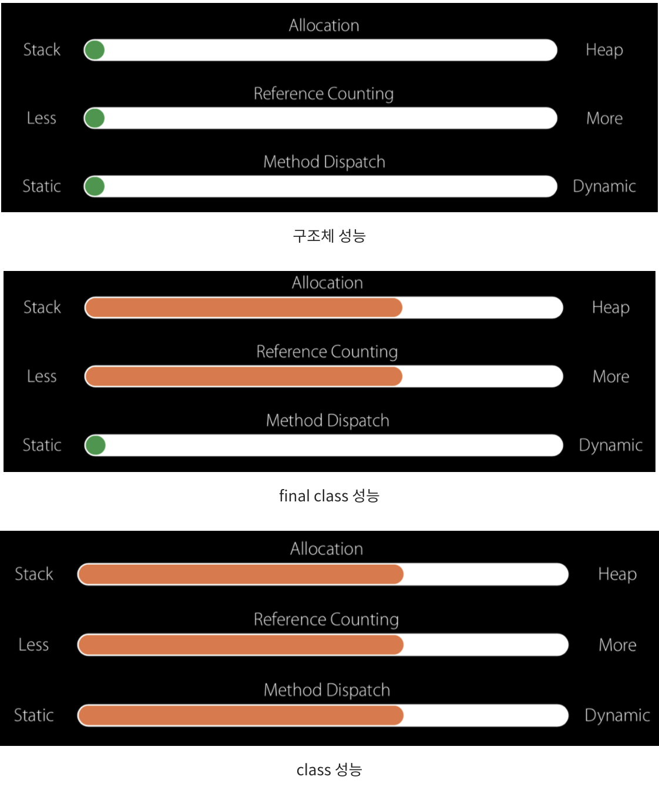

## Writing High-Performance Swift Code를 읽고 바로 적용해 볼 수 있는 팁들을 적용해 보자.

### How?
클래스에서 상속 및 오버라이딩을 하지 않는다면 final , private , filepriavate 사용하기
 

**1. 재정의할 필요가 없을 때 final 키워드를 사용**

final 키워드를 클래스나 메서드/프로퍼티에 사용함으로써 서브클래싱/ override를 제한
 

 

**2. 파일 외부에서 액세스 할 필요가 없는 경우 private / fileprivate 키워드 사용** 

private 및 fileprivate를 적용하면 외부에서 해당 파일에 대한 선언접근을 제한 
 

### Why?
참조타입(Reference Type)의 클래스는 상속가능성이 있기 때문인데 먼저 체계적인 이해를 위해서 디스패치를 알아보자.

디스패치란 어떤 메서드를 호출할 것인지 결정하여 실행하는 메커니즘이다.
swift에서는 스태틱 디스패치 , 다이나믹 디스패치 2가지 방식이 있다. 

 

### 다이나믹 디스패치(Dynamic disaptch) vs 스태틱 디스패치(Static dispatch) 차이점 

호출할 함수를 컴파일 타임/ 런타임 중 어느 시점에 결정하는 것인가의 차이를 가지고 있다. 

이 시점에 따라서 스태틱 디스패치는 직접호출을 수행하거나 다이나믹 디스패치는 vtable을 통해서 간접호출을 수행한다. 

 

### 다이나믹 디스패치 

- 호출방식 :  간접호출

- 런타임에 호출될 함수를 결정한다.

Swift에서는 클래스마다 함수 포인터들의 배열은 vtable을 보유하고 있다. 하위 클래스가 메서드를 호출할 때 이 vtable를 참조하여 실제 호출할 함수를 결정한다. 이 과정들이 런타임에 일어나기 때문에 성능상 손해를 보게 된다고 한다. 

 

### 스태틱 디스패치 

- 호출방식: 직접호출 

- 컴파일 타임에 호출될 함수를 결정하고 런타임 때 그대로 실행 

- 컴파일 타임에 결정이 나기 때문에 성능상 이점을 가질 수 있다. 

 

### More Detail
- 기본적으로 Swift는 각 파일을 개별적으로 컴파일을 한다.

- 이를 통해 Xcode는 여러 파일을 병렬로 매우 빠르게 컴파일할 수 있다. 

- 그러나 각 파일을 개별적으로 컴파일하면 특정 컴파일러 최적화가 방지된다. 

 

클래스는 기본적으로 메서드 및 속성 액세스에 다이나믹 디스패치를 사용한다. 

(struct, enum의 경우는 상속의 개념이 없기 때문에 이런 고민을 할 필요가 없다.)

상속을 하는 경우 어느 클래스의 메서드를 참조해야 하는지 런타임에 결정하기 때문에 각 클래스마다 가지고 있는 vtable 이란 것에 함수 포인터로 두고 런타임 시점에 이 vtable을 사용하여 어떤 메서드를 호출해야 하는지 결정한다. 

 

스위프트에서는 다이나믹 디스패치는 기본적으로 vtable을 통한 간접호출로 설정된다

두 경우 모두 이것은 간접 호출 자체를 수행하는 오버헤드 외에도 많은 컴파일러 최적화를 방지하기 때문에 직접함수 호출보다는 느리다. 

 

다이나믹 디스패치는 런타임시 vtable을 찾아 메서드를 실행하기 때문에 성능상 손해를 본다. 

스태틱 디스패치를 하는 이유는 상속과 오버라이딩의 가능성이 없다면 이 부분을 제한한다는 것이다.

 

값타입(Value type)인 struct와 enum을 사용하여 스태틱 디스패치가 되도록 설계하는 것도 방법이다. 

 

성능적으로 비교해 보면 Struct >  final Class > Class 순이라고 한다. 

<!-- /Users/atlas/Documents/RWorkSpace/ios-docs/blog/testImage.png
/Users/atlas/Documents/RWorkSpace/ios-docs/blog/2021-08-26-welcome/docusaurus-plushie-banner.jpeg -->