## Jetpack Compose 란? 
Jetpack Compose는 Android UI를 빌드하기 위해 사용하는 최신 툴킷

**어노테이션**
추가 정보를 첨부하는 방법입니다. 이 정보는 Jetpack Compose 컴파일러와 같은 도구 및 다른 개발자가 앱의 코드를 이해하는 데 도움이 된다. 

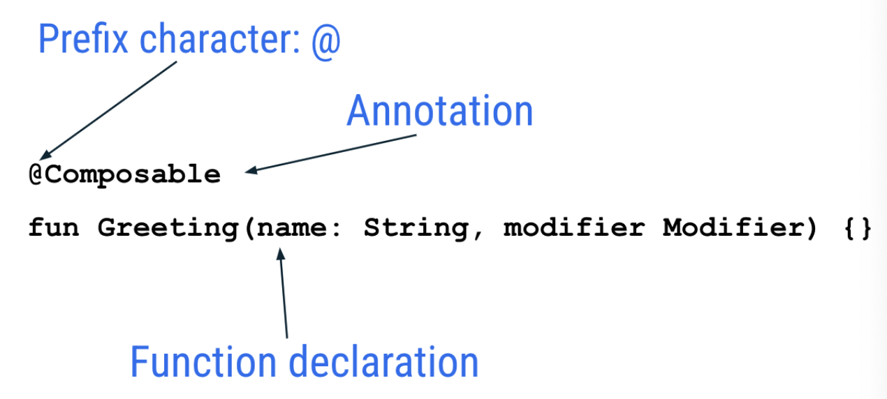


```
// Example code, do not copy it over

@Json
val imgSrcUrl: String

@Volatile
private var INSTANCE: AppDatabase? = null
```
### 매개변수가 있는 주석 
어노테이션은 매배견수를 받을 수 있다. 
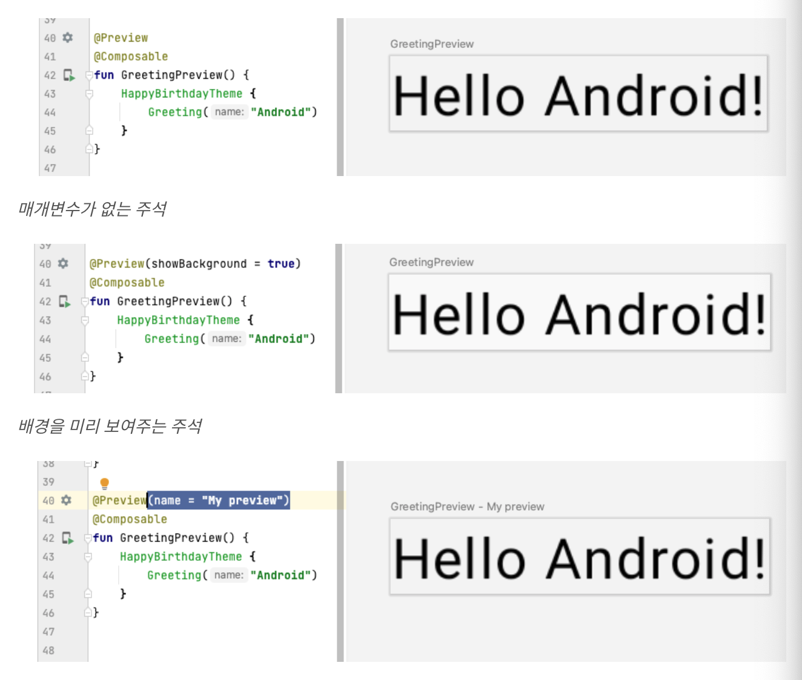


### Composable 
@Composable 어노테이션이 있어야 함수가 데이터를 UI로 변환하게 되어 있다는 것을 Compose 컴파일러에게 알림 
(컴파일러 - 작성한 코드를 한 줄 씩 보고 컴퓨터가 이해할 수 있는 (기계어)로 변환하는 특수 프로그램)

```
@Composable
fun Greeting(name: String) {
    Text(text = "Hello $name!")
}
```


### 폰트 크기 변경 
sp(scalable pixels) :  텍스트의 크기를 지정하기 위해 사용하는 단위
dp(density-independent pixels) : 레이아웃 치수나 위치를 지정하기 위해 사용하는 단위

기본적으로 SP 단위는 DP 단위와 크기가 동일하지만, 사용자가 휴대전화 설정에서 선택한 선호하는 텍스트 크기에 따라 크기가 조절

### 정렬 
섹션에서는 상위 UI 요소 역할을 할 수 있는 Column, Row, Box의 기본 표준 레이아수 요소가 있다. 

**Column**
SwiftUI의 VStack
각 하위 요소는 한 행에 세로로 나란히 배치

**Row**
SwiftUI의 HStack
각 하위 요소는 한 행에 가로로 나란히 배치

**Box**
SwiftUI의 ZStack
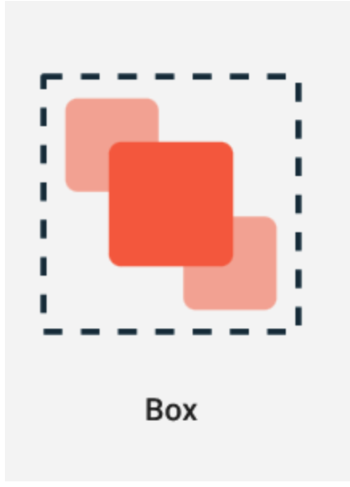

### 람다 문법
코틀린은 마지막 매개변수가 함수일 때 함수를 매개변수로 함수에 전달하는 특수한 문법을 제공 

Composable의 마지막 매개변수는 하위 UI를 내보내는 content 이다. 
```
Row(
    content = {
        Text("Some text")
        Text("Some more text")
        Text("Last text")
    }
)
```

람다표현식으로 아래와 같이 사용가능하다.
```
Row {
    Text("Some text")
    Text("Some more text")
    Text("Last text")
}
```


### 요약
- Jetpack Compose는 Android UI를 빌드하기 위해 사용하는 최신 도구 키트
- Jetpack Compose는 더 적은 수의 코드, 강력한 도구, 직관적인 Kotlin API로 Android에서의 UI 개발을 간소화하고 가속
- 앱의 사용자 인터페이스(UI)는 화면에 표시되는 텍스트, 이미지, 버튼, 기타 여러 유형의 요소
- Composable 함수는 Compose의 기본 구성요소. Composable 함수는 UI의 일부를 설명하는 함수
- Composable 함수는 @Composable 어노테이션으로 사용. 이 함수가 데이터를 UI로 변환한다는 것을 Compose 컴파일러에 알려 줌
- Compose의 세 가지 기본 표준 레이아웃 요소는 Column, Row, Box. 이러한 요소는 컴포저블 콘텐츠를 사용하는 구성 가능한 함수이므로 내부에 항목을 배치가능. 예를 들어, Row 내의 각 하위 요소는 가로로 나란히 배치


## 이미지 추가
`Resource Manager는 앱에서 리소스를 가져오고 만들고 관리하며 사용할 수 있는 도구 창`
리소스 추가하는 방법
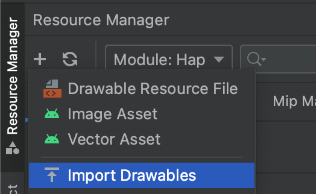


[다양한 픽셀 밀도지원 페이지](https://developer.android.com/training/multiscreen/screendensities?hl=ko)

### 리소스 접근 

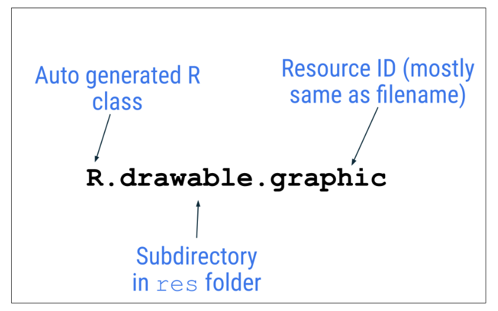

```
R.drawable.graphic
```

**R 클래스**는 Android에서 자동으로 생성되는 클래스로, 프로젝트에 있는 모든 리소스의 ID를 포함. 대부분의 경우 리소스 ID는 파일 이름과 동일. 예를 들어 이전 파일 계층 구조의 이미지는 다음 코드로 액세스가능

```
 val image = painterResource(R.drawable.androidparty)
    Box() {
        Image(painter = image, contentDescription = null)
    }
```
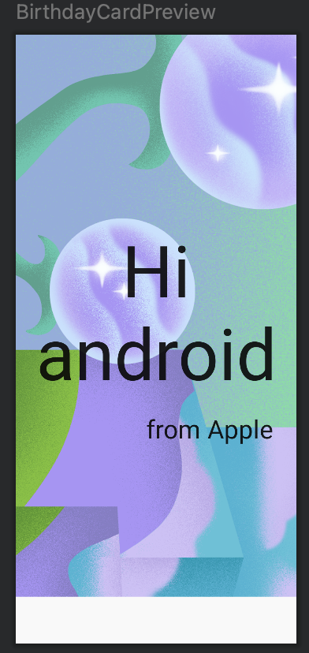

### 불투명도 변경 및 이미지 크기 조정 

콘텐츠 조정 
```
Image(contentScale = ContentScale.Crop)
```
iOS의 contentMode = aspectFill

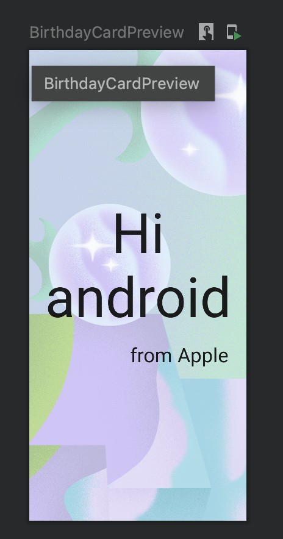

불투명도 조절 
```
Image(alpha = 0.5F)
```

### 레이아웃 Modifier 
arrangement 속성은 레이아웃 크기가 그 하위 요소의 합보다 큰 경우 하위 요소를 정렬하는 데 사용
 Column의 크기가 그 하위 요소 크기의 합보다 큰 경우 verticalArrangement를 지정하여 Column 내 하위 요소의 배치를 정의가능

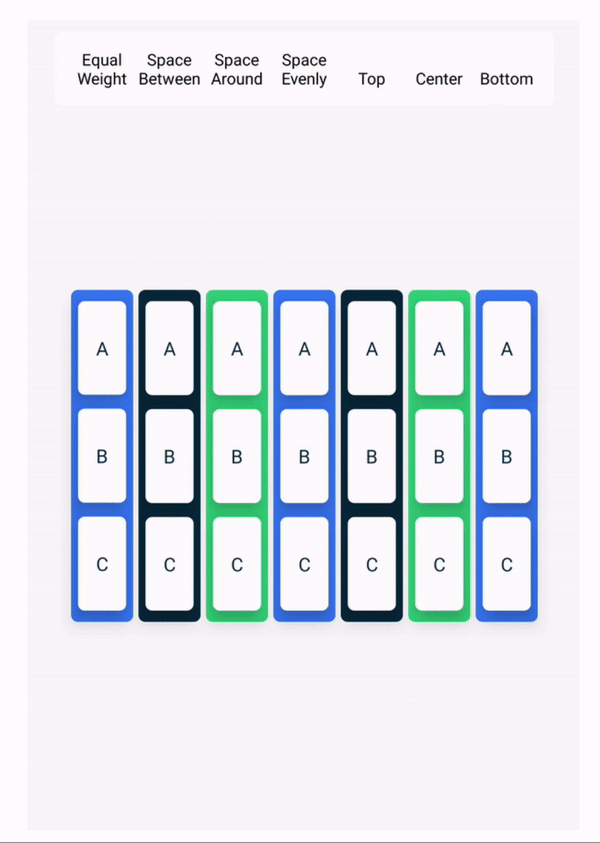

Row의 크기가 그 하위 요소 크기의 합보다 큰 경우 horizontalArrangement를 지정하여 Row 내 하위 요소의 배치를 정의

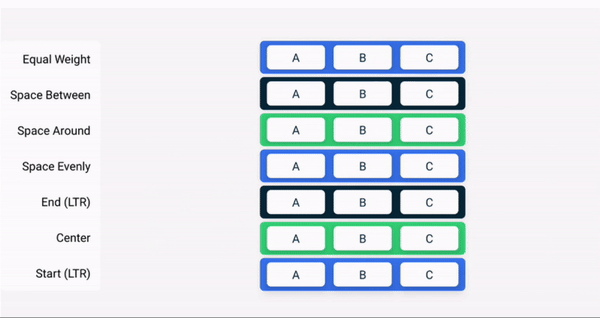

### 텍스트 정렬
```
    Text(textAlign = TextAlign.Center)

    Text(
         modifier = Modifier
            .align(alignment = Alignment.End)
    )
```

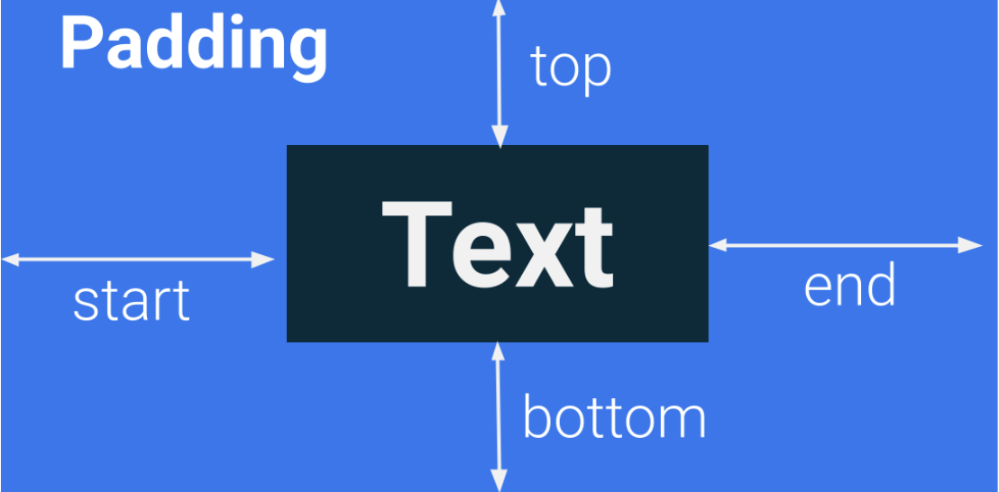
```
Modifier.padding(
    start = 16.dp,
    top = 16.dp,
    end = 16.dp,
    bottom = 16.dp
)

```

### 문자열 관리 

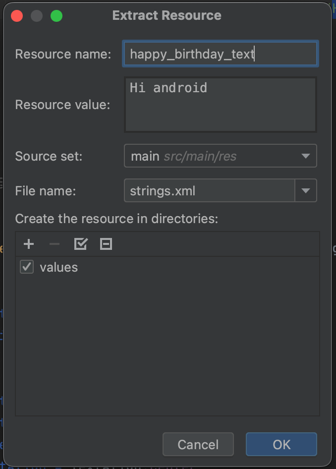

```
BirthdayGreetingWithImage(message = getString(R.string.happy_birthday_text), from = "from Apple")
```

**일부 Android 스튜디오 버전에서는 하드코딩 문자열을 getString() 함수로 바꿉니다. 이 경우 함수를 stringResource()로 수동으로 변경하세요**

```
BirthdayGreetingWithImage(message = stringResource(R.string.happy_birthday_text), from = "from Apple")
```

### 요약
- Android 스튜디오의 Resource Manager 탭을 사용하면 이미지와 기타 리소스를 추가하고 구성가능
- Image 컴포저블은 앱에 이미지를 표시하는 UI 요소
- Image 컴포저블에는 콘텐츠 설명이 있어야 앱의 접근성이 높아짐
- 생일 축하 메시지와 같이 사용자에게 표시되는 텍스트는 문자열 리소스로 추출해야 앱을 다른 언어로 쉽게 번역가능
