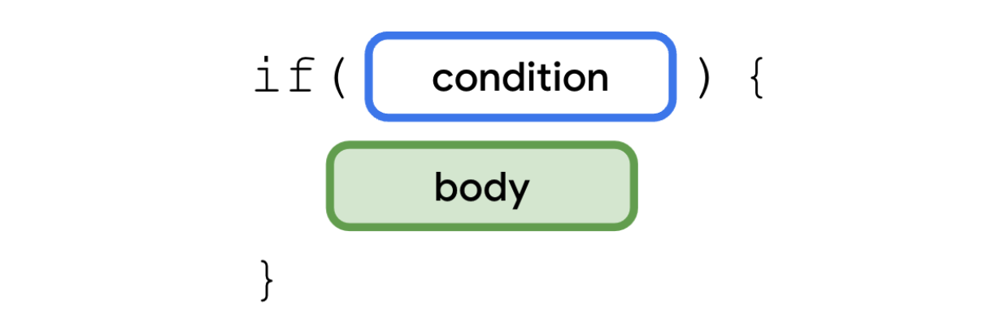
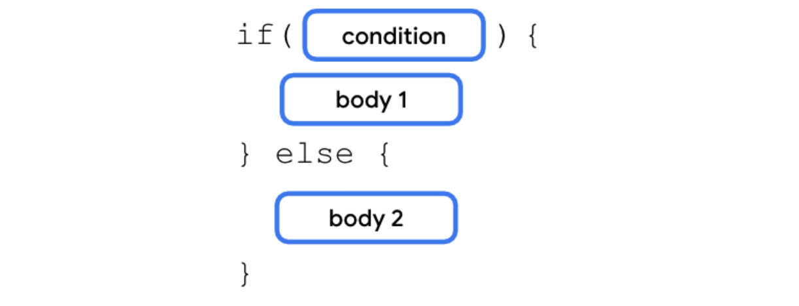
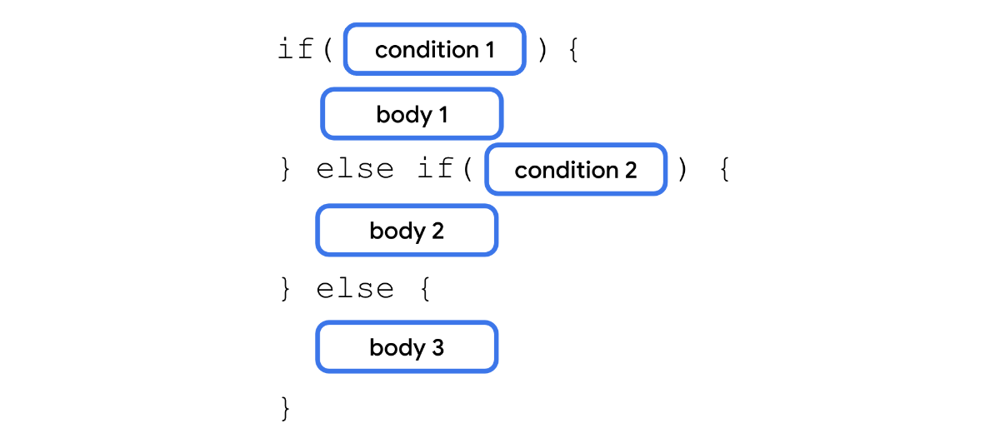

## 코틀린 기초 
### if문
중괄호 안에 있는 문은 if 브랜치의 불리언 표현식이 true 값을 반환할 때만 실행


### else 추가 


### else  if 추가 


### When 문 

when 문은 매개변수를 통해 단일 값을 허용
값이 각 조건을 기준으로 순차적으로 평가


예제
```
fun main() {
    val trafficLightColor = "Yellow"

    when (trafficLightColor) {
        "Red" -> println("Stop")
        "Yellow" -> println("Slow")
        "Green" -> println("Go")
        else -> println("Invalid traffic-light color")
    }
}
```

- trafficLightColor 변수에 "Yellow" 값이 할당
- 프로그램은 각 조건을 하나씩 순서대로 평가
- "Yellow" 값이 "Red" 값과 같지 않으므로 프로그램이 첫 번째 본문을 건너 뜀
- "Yellow" 값은 "Yellow" 값과 같으므로 프로그램은 두 번째 본문을 실행하고 Slow 메시지를 출력
- 본문이 실행되었으므로 프로그램에서는 세 번째, 네 번째 브랜치를 무시하고 when 문을 종료


### 여러 조건에 in 키워드 사용 


```
fun main() {
    val x = 4

    when (x) {
        2, 3, 5, 7 -> println("x is a prime number between 1 and 10.")
        in 1..10 -> println("x is a number between 1 and 10, but not a prime number.")
        else -> println("x isn't a prime number between 1 and 10.")
    }
}
```

### is키워드를 사용하여 데이터 유형 확인 


```
fun main() {
    val x: Any = 4

    when (x) {
        2, 3, 5, 7 -> println("x is a prime number between 1 and 10.")
        in 1..10 -> println("x is a number between 1 and 10, but not a prime number.")
        is Int -> println("x is an integer number, but not between 1 and 10.")
        else -> println("x isn't a prime number between 1 and 10.")
    }
}
```

## Null
```
fun main() {
    var favoriteActor: String = "Sandra Oh"
    favoriteActor = null
}
```


Kotlin에서 null을 허용하는 유형과 null을 허용하지 않는 유형 간에는 차이


Kotlin에서 null을 허용하는 변수를 선언하려면 유형 끝에 ? 연산자를 추가

**수정**
```
fun main() {
    var favoriteActor: String? = "Sandra Oh"
    favoriteActor = null
}
```

### null을 허용하는 변수속성에 엑세스 
**컴파일 오류**
```
fun main() {
    var favoriteActor: String? = "Sandra Oh"
    println(favoriteActor.length)
}
```


### ?.안전호출 연산자 사용
 

 ?. 안전 호출 연산자를 사용하면 null을 허용하는 변수에 더 안전하게 액세스
 Kotlin 컴파일러가 null 참조에 관한 멤버 액세스 시도를 중지하고 액세스된 멤버의 null을 반환하기 때문

 **수정**
```
 fun main() {
    var favoriteActor: String? = "Sandra Oh"
    println(favoriteActor?.length)
}
```

### null이 아닌 어설션 연산자 !! 사용


null이 아닌 !! 어설션은 이름에서 알 수 있듯이 변수의 값이 null이 아님(실제 여부에 관계없이)을 어설션
?. 안전 호출 연산자와 달리 null이 아닌 !! 어설션 연산자를 사용하면 null을 허용하는 변수가 실제로 null일 때 NullPointerException 오류가 발생 할 수 있음

```
fun main() {
    var favoriteActor: String? = "Sandra Oh"
    println(favoriteActor!!.length)
}
```

### if/else 조건문 사용 


```
fun main() {
    var favoriteActor: String? = "Sandra Oh"

    if (favoriteActor != null) {
      println("The number of characters in your favorite actor's name is ${favoriteActor.length}.")
    }
}
```


```
fun main() {
    var favoriteActor: String? = "Sandra Oh"

    val lengthOfName = if(favoriteActor != null) {
      println("The number of characters in your favorite actor's name is ${favoriteActor.length}.")
    } else {
      println("You didn't input a name.")
    }
}
``` 


### ?: Elvis 연산자 사용 


?: Elvis 연산자는 ?. 안전 호출 연산자와 함께 사용할 수 있는 연산자
?: Elvis 연산자를 사용하면 ?. 안전 호출 연산자가 null을 반환할 때 기본값을 추가 가능

``` 
fun main() {
    val favoriteActor: String? = "Sandra Oh"

    val lengthOfName = favoriteActor?.length ?: 0

    println("The number of characters in your favorite actor's name is $lengthOfName.")
}
``` 

## 클래스 
### 생성자 


```
class SmartDevice(val name: String, val category: String) {

    var deviceStatus = "online"

    fun turnOn(){
        println("Smart device is turned on.")
    }

    fun turnOff(){
        println("Smart device is turned off.")
    }
}
``` 


Kotlin의 생성자에는 두 가지 기본 유형이 있습니다.

**기본 생성자** 
클래스에는 클래스 헤더의 일부로 정의된 기본 생성자가 하나임
코드를 포함할 수 없습니다.

**보조 생성자** 
한 클래스에 여러 보조 생성자 선언가능. 
매개변수를 포함하거나 포함하지 않고 보조 생성자를 정의가능 
클래스에 기본 생성자가 있는 경우 각 보조 생성자는 기본 생성자를 초기화함


``` 
class SmartDevice(val name: String, val category: String) {
    var deviceStatus = "online"

    constructor(name: String, category: String, statusCode: Int) : this(name, category) {
        deviceStatus = when (statusCode) {
            0 -> "offline"
            1 -> "online"
            else -> "unknown"
        }
    }
}
``` 


**Kotlin에서는 기본적으로 모든 클래스가 final 즉, 클래스를 확장할 수 없으므로 클래스 간의 관계를 정의해야한다.**

슈퍼클래스에 `open`  키워드를 추가해야한다. 
open 키워드는 클래스의 확장 가능성을 컴파일러에 알림 따라서 이제 다른 클래스가 이 클래스를 확장할 수 있음


## Visibility modifiers
Kotlin은 다음 4가지 공개 상태 수정자를 제공

- public - 기본 공개 상태 수정자. 모든 위치에서 선언에 액세스할 수 있음. 클래스 외부에서 사용하려는 속성과 메서드가 공개로 표시
- private - 동일한 클래스 또는 소스 파일에서 선언에 액세스
클래스 내에서만 사용되며 다른 클래스에서는 사용되지 않도록 할 속성과 메서드에 적용. 이러한 속성과 메서드를 private 공개 상태 수정자로 표시하여 다른 클래스가 실수로 액세스하는 것을 방지
- protected - 서브클래스에서 선언에 액세스. 이러한 클래스와 서브클래스를 정의하는 클래스에 사용하려는 속성과 메서드를 protected 공개 상태 수정자로 표시
- internal - 동일한 모듈에서 선언에 액세스. internal 수정자는 private 수정자와 유사하지만 동일한 모듈에서 액세스된다면 클래스 외부에서 내부 속성과 메서드에 액세스 가능


### 속성 위임 정의 

- 위임을 통해 setter 함수에 범위 확인 코드를 재사용할 수 있음
- 필드, getter 함수, setter 함수를 사용해 값을 관리하는 대신 위임을 통해 관리


```
class RangeRegulator(
    initialValue: Int,
    private val minValue: Int,
    private val maxValue: Int
) : ReadWriteProperty<Any?, Int> {
    override fun getValue(thisRef: Any?, property: KProperty<*>): Int {
    }

    override fun setValue(thisRef: Any?, property: KProperty<*>, value: Int) {
    }
}
```

 `KProperty는 선언된 속성을 나타내는 인터페이스이며, 이를 통해 위임된 속성의 메타데이터에 액세스할 수 있습니다. KProperty의 정의와 관련한 정보를 대략적으로 아는 것이 좋습니다.`


### 요약
- OOP에는 캡슐화, 추상화, 상속, 다형성 등 4가지 기본 원칙이 있다
- 클래스는 class 키워드로 정의되며 속성과 메서드를 포함
- 속성은 맞춤 getter와 setter를 가질 수 있다는 점을 제외하면 변수와 비슷
- 생성자는 클래스의 객체를 인스턴스화하는 방법을 지정
- 기본 생성자를 정의할 때 constructor 키워드를 생략가능
- 상속을 통해 더 쉽게 코드를 재사용 가능 
- IS-A 관계는 상속을 의미
- HAS-A 관계는 컴포지션을 의미
- 공개 상태 수정자는 캡슐화를 달성하는 데 중요한 역할을 힘
- Kotlin은 public, private, protected, internal 등 4가지 공개 상태 수정자를 제공
- 속성 위임을 사용하면 여러 클래스에서 getter 및 setter 코드를 재사용 가능

## Kotlin에서 함수 유형 및 람다 표현식 사용
 함수를 값으로 참조하려면 함수 **참조 연산자(::)**를 사용해야 함 
 
 


```
fun main() {
    val trickFunction = ::trick
}

fun trick() {
    println("No treats!")
}
```

### 람다 표현식을 사용하여 함수 재정의


```
fun main() {
    val trickFunction = trick
    trick()
    trickFunction()
}

val trick = {
    println("No treats!")
}
```

### 함수를 데이터 유형으로 사용 


```
val treat: () -> Unit = {
    println("Have a treat!")
}
```

### 함수를 반환유형으로 사용 


```
fun main() {

}

fun trickOrTreat(isTrick: Boolean): () -> Unit {
}

val trick = {
    println("No treats!")
}

val treat = {
    println("Have a treat!")
}
```


```
fun trickOrTreat(isTrick: Boolean): () -> Unit {
    if (isTrick) {
        return trick
    } else {
        return treat
    }
}
```

### 함수를 다른 함수에 인수로 전달 


```
fun main() {
    val coins: (Int) -> String = { quantity ->
        "$quantity quarters"
    }

    val cupcake: (Int) -> String = {
        "Have a cupcake!"
    }

    val treatFunction = trickOrTreat(false, coins)
    val trickFunction = trickOrTreat(true, cupcake)
    treatFunction()
    trickFunction()
}
```


### null을 허용하는 함수 유형 


```
fun trickOrTreat(isTrick: Boolean, extraTreat: ((Int) -> String)?): () -> Unit {
    if (isTrick) {
        return trick
    } else {
        if (extraTreat != null) {
            println(extraTreat(5))
        }
        return treat
    }
}
```
### 약식 문법으로 람다 표현식 작성


### 람다 표현식을 함수에 직접 전달 


```
fun main() {
    val treatFunction = trickOrTreat(false, { "$it quarters" })
    val trickFunction = trickOrTreat(true, null)
    treatFunction()
    trickFunction()
}
```

## repeat() 함수사용
함수가 함수를 반환하거나 또는 함수를 인수로 취하는 경우 이를 고차 함수


