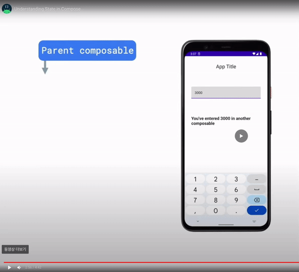
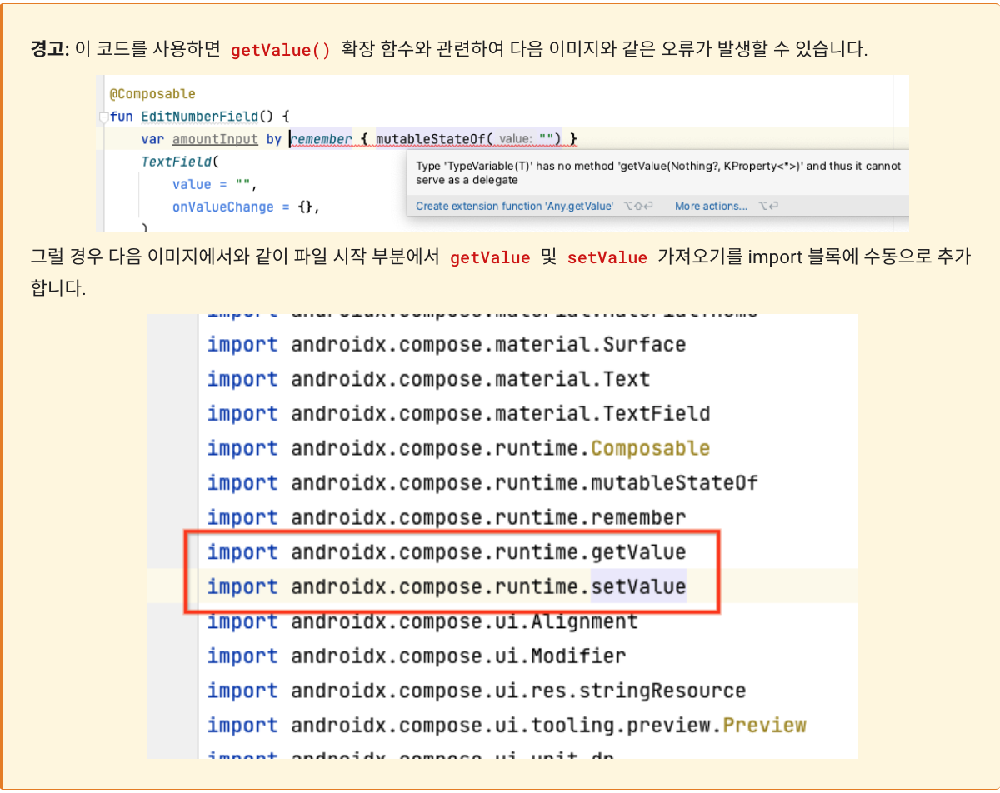

## UI 및 상태와 상호작용

**State는 시간이 지남에 따라 변경될 수 있는 앱의 모든 값**

컴포지션의 작동방식 
compose가 처음으로 Composable을 실행하면 
초기 컴포지션 중에 컴포지션에서 UI 를 설명하기 위해 호출하는 Composable을 추적한다. 
앱 상태가 변경되면 compose 는 재구성을 예약한다. 

compose가 컴포저블을 다시 실행하여 레이블, input field 업데이트와 같은 데이터 변경사항을 UI에 다시 반영합니다. 

그러나 기본적으로 Composable에 정의된 모든 값 또는 변수는 초기값으로 재설정된다. 
그런 다음 Compose는 UI를 재구성한다. 
Composable funcion 은 remember를 사용하여 여러구성에 객체를 저장할 수 있다.

mutableStateof function compose가 변경사항을 관찰하고 재구성을 트리거 할수 있는 흡수 가능한 상태 홀더를 생성

데이터를 다른 Composable과  공유할 수 있도록 이 초기 구성가능 함수에서 상태를 추출해야 합니다. 
Composable 외부의 상태로 이동하는 이프로세스를 상태 호이스팅 state hoisting 이라고 한다. 




Compose는 선언형 UI 프레임워크로, UI의 모습을 코드로 선언하는 것

Compose 앱은 구성 가능한 함수를 호출하여 데이터를 UI로 변환
상태가 변경되면 Compose는 영향을 받는 구성 가능한 함수를 새 상태로 다시 실행
리컴포지션이라는 업데이트된 UI가 만들어진다.
Compose는 자동으로 리컴포지션을 예약한다.


Compose는 초기 컴포지션 시 처음으로 컴포저블을 실행할 때 컴포지션에서 UI를 기술하기 위해 호출하는 컴포저블을 추적한다.
리컴포지션은 Compose가 데이터 변경사항에 따라 변경될 수 있는 컴포저블을 다시 실행한 다음 변경사항을 반영하도록 컴포지션을 업데이트하는 것

컴포지션은 초기 컴포지션을 통해서만 생성되고 리컴포지션을 통해서만 업데이트될 수 있다.


컴포지션을 수정하는 유일한 방법은 리컴포지션을 통하는 것
이렇게 하려면 Compose가 추적할 상태를 알아야 한다.

### MutableState
Compose에서 State 및 MutableState 유형을 사용하여 앱의 상태를 Compose에서 관찰 가능하거나 추적 가능한 상태로 설정할 수 있다.


State 유형은 변경할 수 없어 그 유형의 값만 읽을 수 있는 반면, MutableState 유형은 변경
mutableStateOf() 함수를 사용하여 관찰 가능한 MutableState를 만들 수 있다.
이 함수는 초깃값을 State 객체에 래핑된 매개변수로 수신한 다음, value의 값을 관찰 가능한 상태로 만듬


mutableStateOf() 함수에서 반환하는 값은 다음과 같은 특성

- 상태보유 
- 값변경 
- 관찰가능하므로, Compose는 값의 변경을 관찰하고 리컴포지션을 트리거하여 UI를 업데이트 한다. 


### remember 


**프로세스**
초기 컴포지션 시 TextField의 value은 초깃값 즉, 빈 문자열로 설정

사용자가 텍스트 입력란에 텍스트를 입력하면, onValueChange 람다 콜백이 호출되고 람다가 실행되며 amountInput.value가 텍스트 입력란에 입력된 업데이트 값으로 설정

amountInput은 Compose에 의해 추적되는 변경 가능한 상태이며, 리컴포지션이 예약. 
EditNumberField() 구성 가능한 함수는 재구성. 
remember { }를 사용하므로 변경사항은 재구성 후에도 그대로 유지. 
즉, ""로 다시 초기화되지 않습니다.

텍스트 필드의 value는 저장된 amountInput 값으로 설정. 텍스트 입력란이 재구성(새 값을 사용하여 화면에 다시 그려짐).


## State Hoisting 
컴포저블을 재사용하고 공유할 수 있는 방법으로 상태를 정의하기 위한 위치를 어떻게 결정할지 알아보자.


스테이트풀(Stateful)과 스테이트리스(Stateless) Composable 비교

다음과 같은 경우 상태를 호이스팅해야 합니다.

* 상태를 여러 구성 가능한 함수와 공유하는 경우
* 앱에서 재사용할 수 있는 스테이트리스(Stateless) 컴포저블을 만드는 경우


상태를 추출할 때 결과로 생성되는 구성 가능한 함수를 스테이트리스(Stateless) 함수
스테이트리스(Stateless) 컴포저블은 상태가 없는 컴포저블
즉, 새 상태를 보유하거나 정의하거나 수정하지 않음, 반면 스테이트풀(Stateful) 컴포저블은 시간이 지남에 따라 변할 수 있는 상태를 소유하는 컴포저블입


```
@Composable
fun TipTimeLayout() {
   var amountInput by remember { mutableStateOf("") }
   val amount = amountInput.toDoubleOrNull() ?: 0.0
   val tip = calculateTip(amount)

   Column(
       modifier = Modifier.padding(40.dp),
       horizontalAlignment = Alignment.CenterHorizontally,
       verticalArrangement = Arrangement.Center
   ) {
       Text(
           text = stringResource(R.string.calculate_tip),
           modifier = Modifier
               .padding(bottom = 16.dp)
               .align(alignment = Alignment.Start)
       )
       EditNumberField(
           value = amountInput,
           onValueChange = { amountInput = it },
           modifier = Modifier
               .padding(bottom = 32.dp)
               .fillMaxWidth()
       )
       Text(
           text = stringResource(R.string.tip_amount, tip),
           style = MaterialTheme.typography.displaySmall
       )
       Spacer(modifier = Modifier.height(150.dp))
   }
}

@Composable
fun EditNumberField(
   value: String,
   onValueChange: (String) -> Unit,
   modifier: Modifier = Modifier
) {
   TextField(
       value = value,
       onValueChange = onValueChange,
       singleLine = true,
       label = { Text(stringResource(R.string.bill_amount)) },
       keyboardOptions = KeyboardOptions(keyboardType = KeyboardType.Number),
       modifier = modifier
   )
}
```


### 요약
- 앱의 상태는 시간이 지남에 따라 변할 수 있는 값
- 컴포지션은 Compose가 컴포저블을 실행할 때 빌드한 UI에 관한 설명. Compose 앱은 구성 가능한 함수를 호출하여 데이터를 UI로 변환함
- 초기 컴포지션은 Compose가 구성 가능한 함수를 처음 실행할 때 UI가 생성된 것
- 리컴포지션은 동일한 컴포저블을 다시 실행하여 데이터가 변경될 때 트리를 업데이트하는 프로세스
- 상태 호이스팅은 구성요소를 스테이트리스(Stateless)로 만들기 위해 상태를 호출자로 이동하는 패턴


**ref**

[공식문서 state-hoisting](https://developer.android.com/jetpack/compose/state-hoisting?hl%253Dko)


rememberScrollState()는 스크롤 상태를 만들고 자동으로 기억

## 자동테스트 
소프트웨어의 테스트는 소프트웨어가 예상대로 작동하는지 확인하는 구조화된 방법
자동 테스트는 개발자가 작성한 코드의 또 다른 부분이 올바르게 작동하는지 확인하는 코드
앱 테스트를 일관되게 실행하여 앱을 공개적으로 출시하기 전에 앱의 정확성, 기능 동작 및 사용성을 확인


### 자동 테스트 유형
**로컬 테스트**
로컬 테스트는 소수의 코드를 직접 테스트하여 제대로 작동하는지 확인하는 자동 테스트의 유형


**계측 테스트**
Android 개발의 경우 계측 테스트는 UI 테스트


### 로컬테스트 작성 
@VisibleForTesting 어노테이션 추가 


### 테스트 클래스 만들기 


```
import org.junit.Assert.assertEquals
import org.junit.Test
import java.text.NumberFormat

class TipCalculatorTests {

    @Test
    fun calculateTip_20PercentNoRoundup() {
        val amount = 10.00
        val tipPercent = 20.00
        val expectedTip = NumberFormat.getCurrencyInstance().format(2)
        val actualTip = calculateTip(amount = amount, tipPercent = tipPercent, false)
        assertEquals(expectedTip, actualTip)
    }
}

```


참고: JUnit 라이브러리에는 어설션의 종류 

- assertEquals()
- assertNotEquals()
- assertTrue()
- assertFalse()
- assertNull()
- assertNotNull()
- assertThat()


### 계측 테스트 작성 


앱과 UI의 실제 인스턴스를 테스트하므로 Tip Time 앱 코드를 작성할 때 MainActivity.kt 파일의 onCreate() 메서드에서 콘텐츠를 설정하는 방식과 유사하게 UI 콘텐츠를 설정

UI 구성요소는 composeTestRule을 통해 노드로 액세스할 수 있다.
onNodeWithText() 메서드를 사용하여 특정 텍스트가 포함된 노드에 액세스
onNodeWithText() 메서드를 사용하여 관련한 TextField 컴포저블에 액세스
performTextInput() 메서드를 호출하고 입력하려는 텍스트를 전달

```
class TipUITests {

    @get:Rule
    val composeTestRule = createComposeRule()
    
    @Test
    fun calculate_20_percent_tip() {
        composeTestRule.setContent {
            TipTimeTheme {
                Surface (modifier = Modifier.fillMaxSize()){
                    TipTimeLayout()
                }
            }
        }
        composeTestRule.onNodeWithText("Bill Amount")
            .performTextInput("10")
        composeTestRule.onNodeWithText("Tip Percentage").performTextInput("20")
        val expectedTip = NumberFormat.getCurrencyInstance().format(2)
        composeTestRule.onNodeWithText("Tip Amount: $expectedTip").assertExists(
            "No node with this text was found."
        )
    }
}
```

