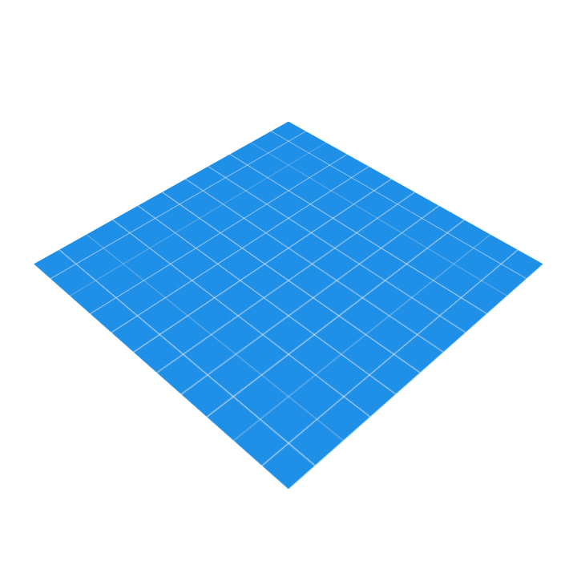

## 스크롤 가능한 목록 빌드하기


### 목록 만들기
목록 항목 구성요소는 목록의 기본 요소

LazyColumn 컴포저블을 사용하여 스크롤 가능한 목록을 만들 수 있다.
사용법

```

LazyColumn(modifier = modifier) {

}

```


Card Composable 

사용법
```

    Card(modifier = modifier) {

    }

```

전체코드 
```
@Composable
fun AffirmationList(affirmationList: List<Affirmation>, modifier: Modifier = Modifier) {
    LazyColumn(modifier = modifier) {
        items(affirmationList) { affirmation ->
            AffirmationCard(
                affirmation = affirmation,
                modifier = Modifier.padding(8.dp)
            )
        }
    }
}

@Composable
fun AffirmationApp() {
    AffirmationsTheme {
        AffirmationList(
            affirmationList = Datasource().loadAffirmations(),
        )
    }
}

@Composable
fun AffirmationCard(affirmation: Affirmation, modifier: Modifier = Modifier) {
    Card(modifier = modifier) {
        Column {
            Image(
               painter = painterResource(id = affirmation.imageResourceId),
                contentDescription = stringResource(id = affirmation.stringResourceId),
                modifier = Modifier
                    .fillMaxWidth()
                    .height(194.dp),
                contentScale = ContentScale.Crop
            )
            Text(
                text = LocalContext.current.getString(affirmation.stringResourceId),
                modifier = Modifier.padding(16.dp),
                style = MaterialTheme.typography.h1
            )

        }
    }
}
```


## 아이콘 변경하기 

- mdpi - 중밀도 화면의 리소스(~160dpi)
- hdpi - 고밀도 화면의 리소스 (~240dpi)
- xhdpi - 초고밀도 화면의 리소스(~320dpi)
- xxhdpi - 초초고밀도 화면의 리소스(~480dpi)
- xxxhdpi - 초초초고밀도 화면의 리소스(~640dpi)
- nodpi - 화면의 픽셀 밀도와 관계없이 조정할 수 없는 리소스
- anydpi - 어떤 밀도로도 조정 가능한 리소스

[밀도한정자 레퍼런스 링크](https://developer.android.com/training/multiscreen/screendensities?hl%253Dko#TaskProvideAltBmp)


### 적응형 아이콘 
Android 8.0 버전(API 수준 26)부터 적응형 아이콘을 지원하여 유연성과 흥미로운 시각적 효과를 더할 수 있다. 




적응형 아이콘은 플랫폼의 API 수준 26에서 추가되었으므로 -v26 리소스 한정자가 있는 mipmap 리소스 디렉터리에서 선언해야 한다.


### 그리드 그리기 
```

  LazyVerticalGrid( modifier = modifier) {

  }

```
