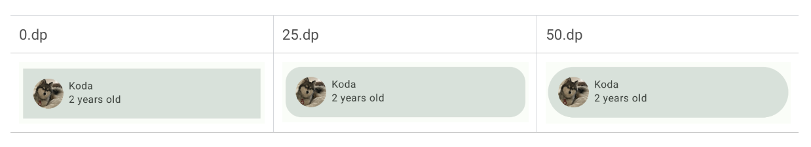
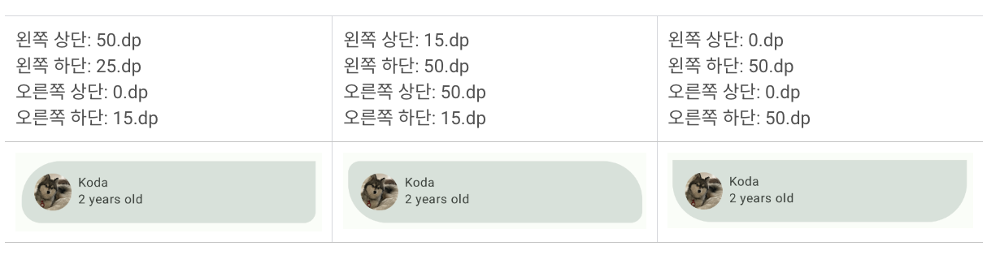

## 색상 추가 


[Material 테마 빌더 ](https://m3.material.io/theme-builder#%252Fcustom)


- primary 색상은 UI에서 주요 구성요소에 사용
- secondary 색상은 UI에서 눈에 덜 띄는 구성요소에 사용
- tertiary 색상은 기본 색상과 보조 색상의 균형을 맞추거나 입력란과 같은 특정 요소로 관심을 유도하는 데 사용할 수 있는 대비 강조를 위해 사용
- on 색상 요소는 팔레트의 색상 위에 나타나며, 주로 텍스트, 아이콘, 획에 적용.우리의 색상 팔레트에는 surface 색상 위에 나타나는 onSurface 색상과 primary 색상 위에 나타나는 onPrimary 색상이 있음.


## 도형 추가 




## 서체 추가 
[Material Design 서체 스케일](https://m3.material.io/styles/typography/type-scale-tokens)!


[Alt text](https://developer.android.com/static/codelabs/basic-android-kotlin-compose-material-theming/img/f4c6f8a842b115dc_1440.png?hl%253Dko)


글꼴 초기화
```
​​import androidx.compose.ui.text.font.Font
import androidx.compose.ui.text.font.FontFamily
import com.example.woof.R

val AbrilFatface = FontFamily(
   Font(R.font.abril_fatface_regular)
)
```

FontWeight.Bold 를 명시적으로 연결해야한다. 
```
import androidx.compose.ui.text.font.FontWeight

val AbrilFatface = FontFamily(
   Font(R.font.abril_fatface_regular)
)

val Montserrat = FontFamily(
   Font(R.font.montserrat_regular),
   Font(R.font.montserrat_bold, FontWeight.Bold)
)
```
```
import androidx.compose.ui.text.TextStyle
import androidx.compose.ui.unit.sp

val Typography = Typography(
   displayLarge = TextStyle(
       fontFamily = AbrilFatface,
       fontWeight = FontWeight.Normal,
       fontSize = 36.sp
   ),
   displayMedium = TextStyle(
       fontFamily = Montserrat,
       fontWeight = FontWeight.Bold,
       fontSize = 20.sp
   ),
   labelSmall = TextStyle(
       fontFamily = Montserrat,
       fontWeight = FontWeight.Bold,
       fontSize = 14.sp
   ),
   bodyLarge = TextStyle(
       fontFamily = Montserrat,
       fontWeight = FontWeight.Normal,
       fontSize = 14.sp
   )
)

```

적용 
```
Column {
            Text(
                text = stringResource(dogName),
                style = MaterialTheme.typography.body2,
                modifier = modifier.padding(top = dimensionResource(id = R.dimen.padding_small))
            )
            Text(
                text = stringResource(R.string.years_old, dogAge),
                style = MaterialTheme.typography.button

            )
}
```


## 상단바 추가 

Scaffold 다양한 구성요소와 화면 요소(Image, Row, Column)의 슬롯을 제공하는 레이아웃
[Scaffold](https://developer.android.com/reference/kotlin/androidx/compose/material3/package-summary?hl%253Dko#Scaffold%2528androidx.compose.ui.Modifier%252Ckotlin.Function0%252Ckotlin.Function0%252Ckotlin.Function0%252Ckotlin.Function0%252Candroidx.compose.material3.FabPosition%252Candroidx.compose.ui.graphics.Color%252Candroidx.compose.ui.graphics.Color%252Candroidx.compose.foundation.layout.WindowInsets%252Ckotlin.Function1%2529)


[TopAppBar](https://developer.android.com/reference/kotlin/androidx/compose/material3/package-summary?hl%253Dko#TopAppBar%2528kotlin.Function0%252Candroidx.compose.ui.Modifier%252Ckotlin.Function0%252Ckotlin.Function1%252Candroidx.compose.foundation.layout.WindowInsets%252Candroidx.compose.material3.TopAppBarColors%252Candroidx.compose.material3.TopAppBarScrollBehavior%2529)


TopAppBar는 여러 용도로 사용할 수 있지만, 여기서는 앱에 브랜딩과 개성을 적용하는 용도로 사용

## 아이콘 추가 

Material Design은 대부분의 요구에 부합하는 다수의 아이콘을 일반적인 카테고리로 정리하여 제공

[아이콘](https://material.io/resources/icons/?style%253Dbaseline)


사용법 
1.프로젝트에 material-icons-extended 라이브러리 종속 항목을 추가
2.Project 창에서 Gradle Scripts > build.gradle.kts (Module :app)
3.build.gradle.kts (Module :app)파일, dependencies{} 블록에 다음 줄을 추가


remember() 및 mutableStateOf()의 복습:

Compose가 상태 값의 변경사항을 관찰하고 UI를 업데이트하도록 리컴포지션을 트리거하도록 mutableStateOf() 함수를 사용합니다. mutableStateOf() 함수 호출을 remember() 함수로 래핑하여 초기 컴포지션 중에 컴포지션에 값을 저장하고 저장된 값은 리컴포지션 중에 반환됩니다.


### 더보기 버튼 정렬

참고: Modifier.weight()는 가중치가 적용된 동위 요소(행 또는 열의 다른 하위 요소)를 기준으로 UI 요소의 너비/높이를 요소의 가중치에 비례하여 설정 

 

```
 Spacer(modifier = Modifier.weight(1f))
```

### 애니메이션 추가 

Damping ratio: 스프링의 탄성
Stiffness level: 스프링이 끝까지 이동하는 속도

[공식 홈 레퍼런스](https://developer.android.com/reference/kotlin/androidx/compose/animation/core/Spring?hl%253Dko)


High bounce 


No bounce


High stiffness


Very low Stifness


사용법 
```
Column(
            modifier = Modifier.animateContentSize()
    ) {
    
    }
```


```
import androidx.compose.animation.core.Spring
import androidx.compose.animation.core.spring

Column(
   modifier = Modifier
       .animateContentSize(
           animationSpec = spring(
               dampingRatio = Spring.DampingRatioNoBouncy,
               stiffness = Spring.StiffnessMedium
           )
       )
)
```

```
     modifier = Modifier.animateContentSize(
                animationSpec = spring(
                    dampingRatio = Spring.DampingRatioNoBouncy,
                    stiffness = Spring.StiffnessMedium
                )
            )
```

도전과제 - expand 시 색상변경 
```
 val color by animateColorAsState(
        targetValue = if (expanded) MaterialTheme.colorScheme.tertiaryContainer
        else MaterialTheme.colorScheme.primaryContainer,
    )
    Card(
        modifier = modifier
    ) {
        Column(
            modifier = Modifier
                .animateContentSize(
                    animationSpec = spring(
                        dampingRatio = Spring.DampingRatioNoBouncy,
                        stiffness = Spring.StiffnessMedium
                    )
                )
                .background(color = color)
        ) {
        }
    }
```


결과화면 


## Talk back 
사용자가 화면을 보지 않고도 기기를 탐색할 수 있도록 음성 피드백을 제공하는 Google 스크린 리더

contentDescription 속성을 사용하여 시각적 요소를 설명할 수 있다.


개선 
 1. 터치영역 수정 IconButton 컴포저블에 관한 문서에는 최소 터치 영역 크기가 48dp x 48dp이라고 나와 있음 
 2. 색상대비 
    1. 충분한 고대비는 다양한 시각 장애를 지닌 사용자에게 도움이 될 뿐 아니라 모든 사용자가 직사광선에 노출되었거나 어두운 곳에 있는 등 극단적인 채광 조건에서 기기의 인터페이스를 볼 때 도움이 됨
   

