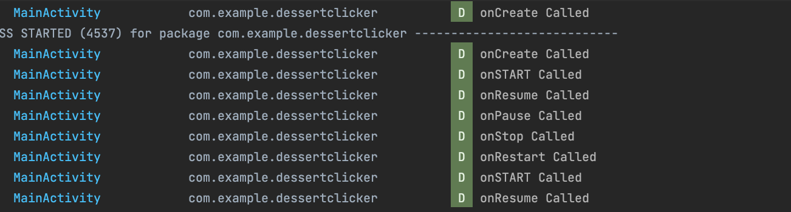
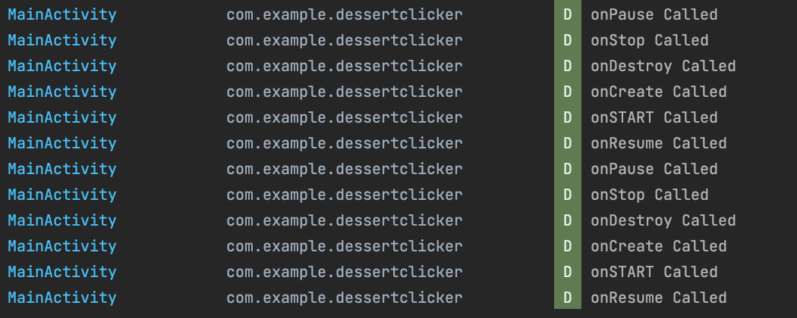

## 액티비티 라이프 사이클
### 수명주기 메서드 및 기본 로깅 추가 


로깅 

컴파일 시간 상수로 표시하려면 변수를 선언할 때 const를 사용
컴파일 시간 상수는 컴파일 중에 알려진 값

Log 클래스는 Logcat에 메시지를 확인할 수 있다. 
Logcat은 메시지를 기록하는 콘솔

Log.v()가 상세 메시지를 기록
Log.d() 메서드는 디버그 메시지를 작성
다른 메서드에는 정보 메시지의 경우 Log.i()
경고의 경우 Log.w()
오류 메시지의 경우 Log.e()


### 액비비티 라이프 사이클 


onCreate(): 시스템이 앱을 생성할 때 호출

onStart(): 앱이 화면에 표시되도록 하지만 사용자는 아직 앱과 상호작용할 수 없음

onResume(): 앱을 포그라운드로 가져오고 사용자는 이제 앱과 상호작용할 수 있음.

onPause()가 호출되면 앱에 더 이상 포커스가 없음

onStop() 이후에는 앱이 더 이상 화면에 표시되지 않음

활동이 중지되었지만 Activity 객체는 여전히 백그라운드에서 메모리에 . 사용자가 앱으로 돌아올 수 있으므로 Android는 활동 리소스를 유지함



기기 회전시에 라이프 사이클 변동



## 앱아키텍처 
아키텍처 원칙 
1.separation of concerns 
2.driving UI from a model

관심사 분리 
관심사 분리 디자인원칙은 각각 별개의 책임이 있는 여러 함수 클래스로 앱을 나워야한다는 원칙 

### 권장 앱 아키텍처
이전 섹션에서 언급한 일반적인 아키텍처 원칙에 따라 각 앱에는 최소한 다음 두 가지 레이어가 포함되어야 한다. 

UI 레이어: 화면에 앱 데이터를 표시하지만 데이터와는 무관한 레이어
데이터 레이어: 앱 데이터를 저장하고, 가져오고, 노출하는 레이어


### UI Layer
화면에 어플리케이션 데이터를 표시하는것 


UI 레이어의 구성요소

UI 요소: 화면에 데이터를 렌더링하는 구성요소. 이러한 요소는 Jetpack Compose를 사용하여 빌드합
상태 홀더: 데이터를 보유하고 UI에 노출하며 앱 로직을 처리하는 구성요소. 상태 홀더의 예로 ViewModel을 들 수 있음


### ViewModel 

뷰모델은 UI가 사용하는 상태를 보유하고 노출한다. 
UI상태는 viewModel에 의해 변환된 어플리케이션 데이터 
ViewModel을 사용하면 앱이 모델에서 UI 만들기 아키텍처 원칙을 따르도록 할 수 있음 

ViewModel은 Android 프레임워크에서 활동이 소멸되고 다시 생성될 때 폐기되지 않는 앱 관련 데이터를 저장

액티비티 인스턴스와 달리 ViewModel 객체는 소멸되지 않는다. 

앱은 구성 변경 중에 자동으로 ViewModel 객체를 유지하므로 객체가 보유하고 있는 데이터는 재구성 후에 즉시 사용 가능하다.

앱에 ViewModel을 구현하려면 아키텍처 구성요소 라이브러리에서 가져온 ViewModel 클래스를 확장하고 이 클래스 내에 앱 데이터를 저장한다.

### UI 상태 
사용자가 보는 항목이 UI라면 UI상태는 앱에서 사용자가 뵈야한다고 지정하는 항목
UI는 UI상태를 시작적으로 나타낸다. UI상태가 변경되면 변경사항이 즉시 UI에 반영 됨 


```
// Example of UI state definition, do not copy over

data class NewsItemUiState(
    val title: String,
    val body: String,
    val bookmarked: Boolean = false,
    ...
)
```

**불변성**
위 예에서 UI 상태 정의는 변경할 수 없다.
 변경할 수 없는 객체는 여러 소스가 한순간에 앱의 상태를 변경하지 않도록 보장. 
 덕분에 UI는 상태를 읽고 이에 따라 UI 요소를 업데이트하는 한 가지 역할에 집중할 수 있다. 
 따라서 UI 자체가 데이터의 유일한 소스인 경우를 제외하고 UI에서 UI 상태를 직접 수정해서는 안된다.
이 원칙을 위반하면 동일한 정보가 여러 정보 소스에서 비롯되어 데이터 불일치와 미세한 버그가 발생한다.


## 뷰모델 추가하기 

1.위치: build.gradle.kts (Module :app)

```
dependencies {
// other dependencies

    implementation("androidx.lifecycle:lifecycle-viewmodel-compose:2.6.1")
//...
}
```

2.ui 에서 파일을 만들고 ViewModel 확장 
```
import androidx.lifecycle.ViewModel

class GameViewModel : ViewModel() {
}
```

3.ui 패키지에서 GameUiState라는 상태 UI의 모델 클래스를 추가
```
data class GameUiState(
   val currentScrambledWord: String = ""
)
```

asStateFlow()는 이 변경 가능 상태 흐름을 읽기 전용 상태 흐름으로 만들어 주기 
```
import kotlinx.coroutines.flow.StateFlow
import kotlinx.coroutines.flow.asStateFlow

// Game UI state
private val _uiState = MutableStateFlow(GameUiState())
val uiState: StateFlow<GameUiState> = _uiState.asStateFlow()
```


## StateFlow
StateFlow는 현재 상태와 새로운 상태 업데이트를 내보내는 관찰 가능한 데이터 홀더 흐름
StateFlow의 value 속성은 현재 상태 값을 반영 
상태를 업데이트하고 흐름에 전송하려면 MutableStateFlow 클래스의 value 속성에 새 값을 할당

Android에서 StateFlow는 관찰 가능한 불변 상태를 유지해야 하는 클래스에서 잘 작동함


```
import kotlinx.coroutines.flow.MutableStateFlow

// Game UI state
private val _uiState = MutableStateFlow(GameUiState())

```


### Backing Field

backing field는 프로퍼티의 값을 저장하기 위한 필드다. 코틀린에서는 필드를 바로 선언할 수 없고 프로퍼티로 선언하면 아래의 경우에 자동으로 backing field가 생긴다


## Compose UI 설계 
Compose에서 UI를 업데이트하는 유일한 방법은 앱 상태를 변경하는 것
개발자가 제어할 수 있는 것은 UI 상태


### 단방향 데이터 흐름 
단방향 데이터 흐름(UDF)은 상태는 아래로 이동하고 이벤트는 위로 이동하는 디자인 패턴


단방향 데이터 흐름을 사용하는 앱의 UI 업데이트 루프

이벤트: UI의 일부가 이벤트를 생성하여 위쪽으로 전달하거나(예: 처리하기 위해 ViewModel에 전달되는 버튼 클릭) 앱의 다른 레이어에서 이벤트가 전(예: 사용자 세션이 종료되었음을 표시)
상태 업데이트: 이벤트 핸들러가 상태를 변경가능
상태 표시: 상태 홀더가 상태를 아래로 전달하고 UI가 상태를 표시


앱 아키텍처에 UDF 패턴을 사용하면 다음과 같은 영향이 있음 

- ViewModel은 UI가 사용하는 상태를 보유하고 노출합
- UI 상태는 ViewModel에 의해 변환된 애플리케이션 데이터를 가지고 있음 
- UI가 ViewModel에 사용자 이벤트를 알림
- ViewModel이 사용자 동작을 처리하고 상태를 업데이트함
- 업데이트된 상태가 렌더링할 UI에 다시 제공
- 상태 변경을 일으키는 모든 이벤트에 대해 이 프로세스가 반복


### 데이터 전달하기 
collectAsState() 함수는 이 StateFlow에서 값을 수집하고 State를 통해 최신 값을 나타냅


## 테스트코드 

### 테스트전략
좋은 단위 테스트에는 일반적으로 다음 4가지 특성이 있습니다.

집중: 코드 조각과 같은 단위를 테스트하는 데 중점을 두어야 함
이 코드 조각은 대부분 클래스 또는 메서드. 테스트의 범위를 좁히고 동시에 여러 코드가 아닌, 개별 코드의 정확성을 검증하는 데 집중해야 함

이해 가능: 코드를 읽을 때 간단하고 이해하기 쉬워야 함. 개발자는 테스트의 의도를 한눈에 파악할 수 있어야 함

확정성: 일관되게 통과하거나 실패해야 합니다. 코드를 변경하지 않고 테스트를 여러 번 실행하면 테스트의 결과가 동일해야 함. 테스트는 코드를 수정하지 않았는데도 어떤 때는 실패하고 어떤 때는 통과하는 것처럼 불안정해서는 안 됨

독립형: 사람이 상호작용하거나 설정할 필요가 없으며 개별적으로 실행됨


