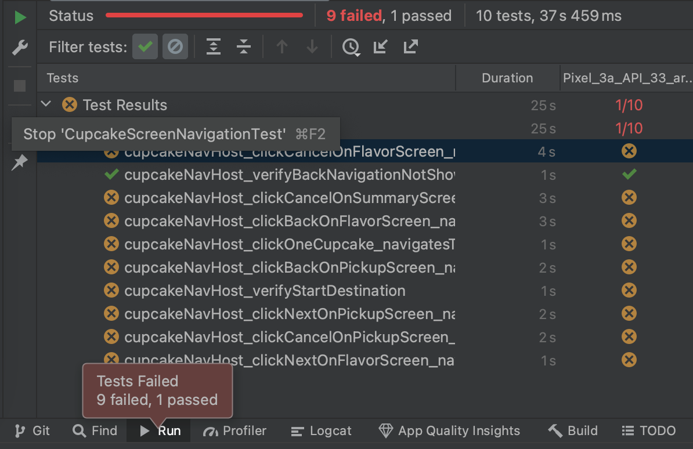
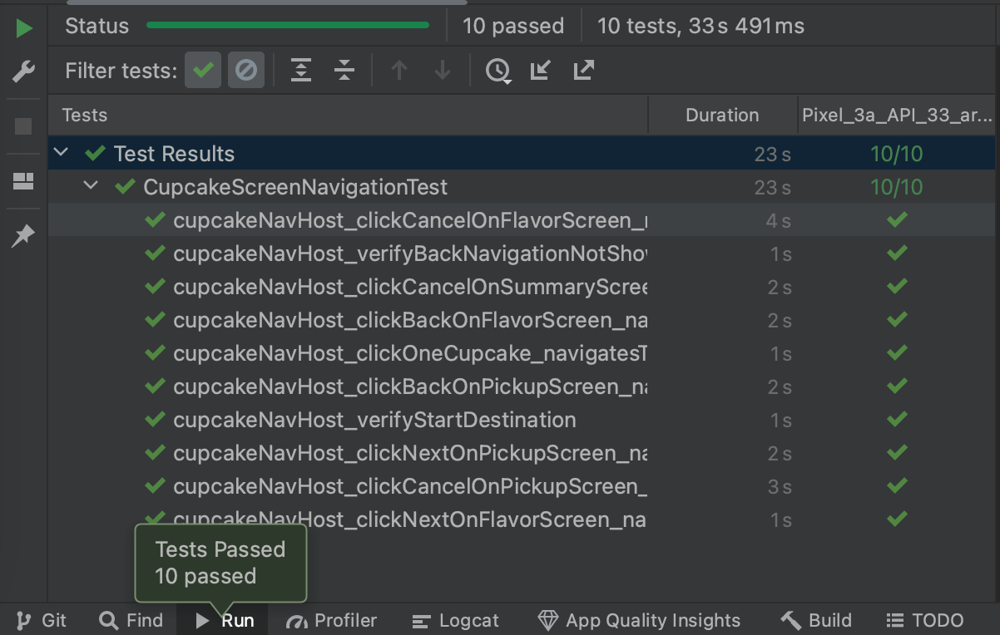

### Compose를 사용하여 화면 간 이동 

Navigation 구성요소의 부분
Navigation 구성요소에는 다음과 같은 세 가지 주요 부분이 있습니다.

- NavController: 대상(즉, 앱의 화면) 간 이동을 담당
- NavGraph: 이동할 컴포저블 대상을 매핑
- NavHost: NavGraph의 현재 대상을 표시하는 컨테이너 역할을 하는 컴포저블

### 문법


매개변수 
- navController: NavHostController 클래스의 인스턴스. navigate() 메서드를 호출하여 다른 대상으로 이동하는 등의 방식으로 화면 간에 이동하는 데 이 객체를 사용할 수 있음. 구성 가능한 함수에서 rememberNavController()를 호출하여 NavHostController를 가져올 수 있음
- startDestination: 앱에서 NavHost를 처음 표시할 때 기본적으로 표시되는 대상을 정의하는 문자열 경로.

**NavHostController는 NavHost 컴포저블과 함께 사용할 추가 기능을 제공하는 NavController 클래스의 서브클래스**


### NavHost에서 경로 처리


NavHost의 콘텐츠 함수 내에서 composable() 함수를 호출

- route: 경로 이름에 해당하는 문자열. 모든 고유 문자열을 사용. CupcakeScreen enum의 상수 이름 속성을 사용.
- content: 여기에서 특정 경로에 표시할 컴포저블을 호출


**참고: composable() 함수는 NavGraphBuilder의 확장 함수입니다.**


## UI Test 
junit 라이브러리에서 제공하는 @Before 주석을 사용하여 자동으로 이 작업을 실행할 수 있다.
메서드가 **@Before로** 주석 처리되면 @Test 주석이 달린 모든 메서드보다 먼저 실행됨.


[LocalContext.current](https://developer.android.com/jetpack/compose/compositionlocal?hl%253Dko)


Android 앱에서 흔히 사용되는 LocalContext CompositionLocal의 현재 Context 값을 사용하여 텍스트의 형식을 지정

CompositionLocal은 암시적으로 컴포지션을 통해 데이터를 전달하는 도구

CompositionLocal 요소는 일반적으로 UI 트리의 특정 노드의 값과 함께 제공. 이 값은 구성 가능한 함수에서 CompositionLocal을 매개변수로 선언하지 않아도, 구성 가능한 하위 요소에 사용할 수 있음

CompositionLocal의 current 값은 컴포지션에서 범위가 지정된 부분의 상위 요소가 제공한 가장 가까운 값에 대응


apply
수신 객체 람다 내부에서 수신 객체의 함수를 사용하지 않고 수신 객체 자신을 다시 반환 하려는 경우에 
apply 를 사용


사용하지 않는 경우 (동일한 코드)
```
val clark = Person()
clark.name = "Clark"
clark.age = 18
```

사용한 경우 
```
val peter = Person().apply {
    // apply 의 블록 에서는 오직 프로퍼티 만 사용합니다!
    name = "Peter"
    age = 18
}
```

테스트 코드 사용 예시
```
 navController = TestNavHostController(LocalContext.current).apply {
                navigatorProvider.addNavigator(ComposeNavigator())
        }

```

**참고** 
AndroidComposeTestRule은 자동으로 앱을 실행하여 @Test 메서드가 실행되기 전에 CupcakeApp 컴포저블을 표시함. 따라서 앱을 실행하려고 테스트 메서드에서 추가 단계를 실행할 필요가 없음


### 테스트 실패시 



### 테스트 성공시 



