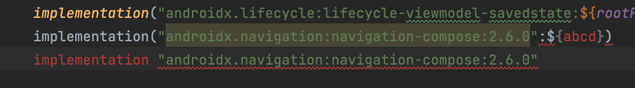

# Migrating Groovy DSL to Kotlin DSL


DSL ( Domain Specific Language)
: 특정 분야에 최적화된 프로그래밍 언어 

Kotlin DSL은 코틀린의 언어적인 특징으로 가독성이 좋고 간략한 코드를 사용하여 Gradle 스크립팅을 하는 것을 목적으로 하는 DSL이다. 

Kotlin DSL은
Gradle 5.0 부터 지원하기 시작함

## [용어](https://developer.android.com/studio/build/migrate-to-kts?hl%253Dko)

KTS: Gradle이 빌드 구성 파일에서 사용하는 Kotlin 언어 버전인 Kotlin 스크립트를 나타냄. Kotlin 스크립트는 명령줄에서 실행할 수 있는 Kotlin 코드

Kotlin DSL: Android Gradle 플러그인 Kotlin DSL을 나타내는 경우가 대부분이나 기본 Gradle Kotlin DSL을 나타내는 경우도 있음

Groovy에서 이전하는 맥락에서 'KTS'와 'Kotlin DSL'이란 용어는 같은 의미로 사용할 수 있음. 즉, Android 프로젝트를 Groovy에서 KTS로 변환하거나 Groovy에서 Kotlin DSL로 변환하는 것은 동일한 작업임.

### 장점
- 컴파일 타임에 에러 확인 
  - Kotlin DSL 문법오류 강조표시 
    
  - Groovy DSL은 런타임에 확인 가능 
    
- 코드 탐색
- 자동 완성 
- 구문 강조
- IDE의 지원으로 향상된 편집환경
- 소스 코드와 동일한 언어의 사용 


### 단점 
- 빌드 캐시가 invalidation 되거나 클린 빌드시에 Groovy DSL보다 느리다. 
  ( [Expected Behavior](https://github.com/gradle/gradle/issues/15886#issuecomment-1432923669) )
  


### 사용법 

- 파일 확장자 변경
  
   `*.gradle ->  *.gradle.kts`

- 모든 문자열은 큰따옴표(" ")로 작성 
  

- 메서드 호출시 괄호 추가 
    ```
    //동일한 코드 

    //Groovy
    compileSdkVersion 30
    
    //Kotlin
    compileSdkVersion(30)
    ```
- 할당 시 `=` 추가 
     ```
     //Groovy
      java {
          sourceCompatibility JavaVersion.VERSION_17
          targetCompatibility JavaVersion.VERSION_17
          }

    //Kotlin
      java {
          sourceCompatibility = JavaVersion.VERSION_17
          targetCompatibility = JavaVersion.VERSION_17 
          }

     ```
- 문자열 보간 유형 
    ```
    //Groovy
        myRootDirectory = "$project.rootDir/tools/proguard-rules-debug.pro"
    
    //Kotlin
        myRootDirectory = "${project.rootDir}/tools/proguard-rules-debug.pro"
    


    ```


[안드로이드 공식 홈페이지 참조](https://developer.android.com/studio/build/migrate-to-kts?hl%253Dko)
---


**Tips** 
 
 Gradle 공식 문서를 보면 플러그인 {} 블록을 사용하여 Gradle 플러그인을 선언하면 편집 환경이 크게 향상 되기 떄문에 적극 권장함