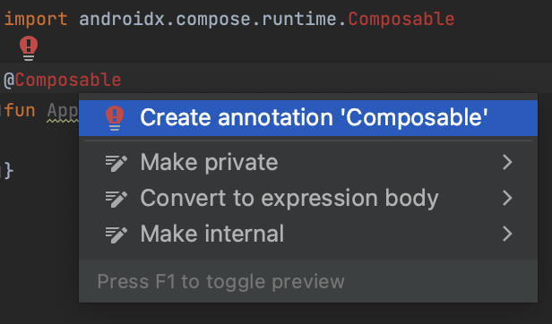

### 이슈
프로젝트 생성시 commonMain에서 Composable을 사용할 수 없음




### 해결방법
#### build.gradle.kts(Project: )
변경
```
    id("com.android.application").version("8.0.2").apply(false)
    id("com.android.library").version("8.0.2").apply(false)
```

추가
```
id("org.jetbrains.compose").version("1.5.0").apply(false)
```


#### build.gradle.kts(Moduel:shared )

```
plugins {
    ...
    id("org.jetbrains.compose")
}

sourceSets {
        val commonMain by getting {
            dependencies {
                //put your multiplatform dependencies here
                implementation(compose.ui)
            }
        }
    }

```

### 결과화면


## Thanks to Carter-rs