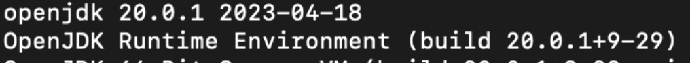
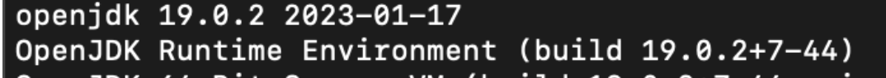

## Unknown Kotlin JVM target: 20

Preference에서 Gradle에서 compile버전을 낮추는 방법, JVM 타켓을 변경하는 방법을 시도해 보았지만 동일한 에러로 빌드가 되지 않는 상황


현재 사용하고 있는 자바 버전확인
```
java --version
```

20.0.1 버전을 사용하고 있는 것 확인 


### 이전버전으로 대체하는 방법 진행 

[jdk-19.0.2 다운로드](https://www.oracle.com/java/technologies/javase/jdk19-archive-downloads.html)

1. User > 라이브러리 > Java > JavaVirtualMachines 폴더에 진입
2. openjdk-20.0.1 삭제
3. 다운로드 받은 jdk-19.0.2.jdk 옮기기


안드로이드 스튜디오에서 클린 빌드를 하면 정상동작하는것을 확인할 수 있음 

자바버전을 확인
