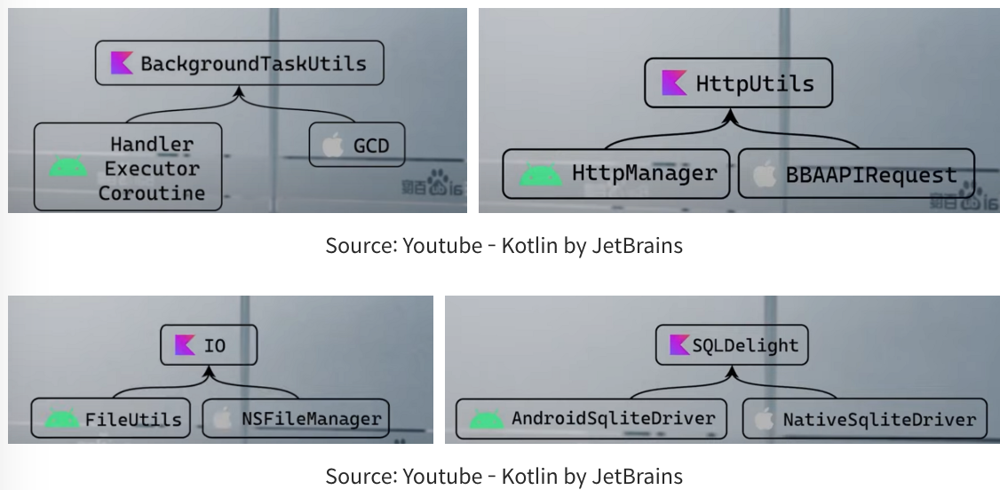
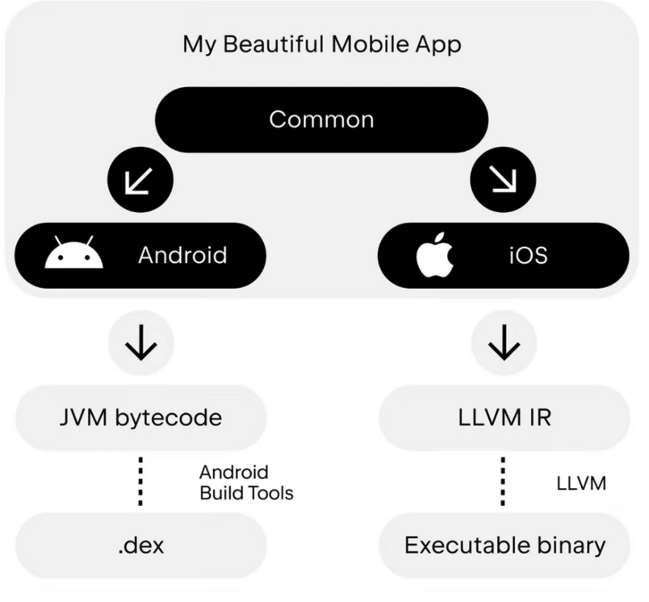
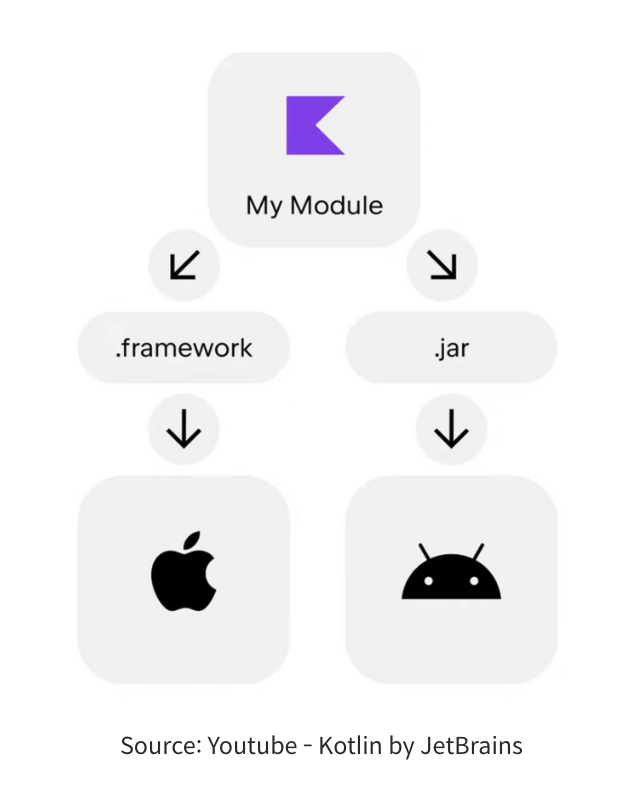
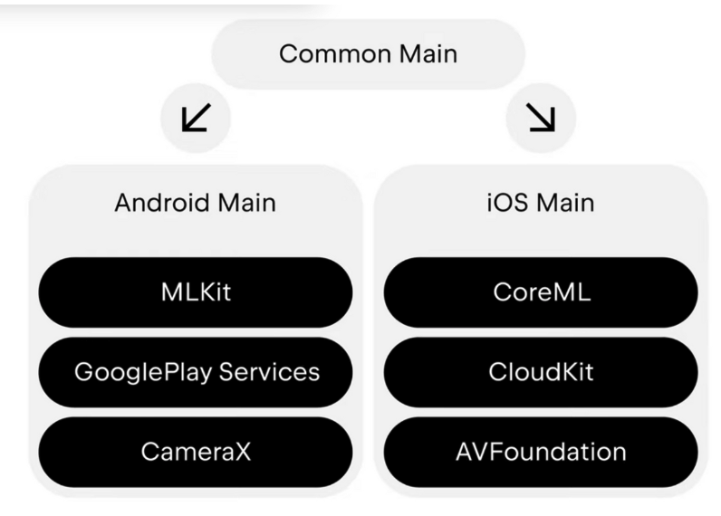
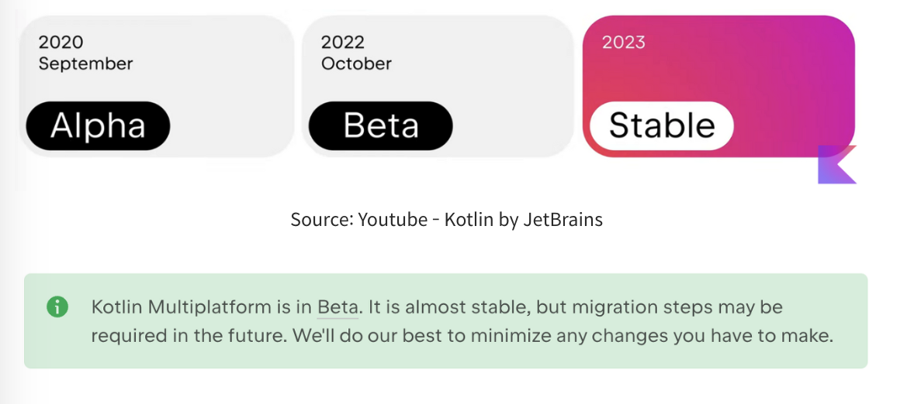

## 코틀린 멀티 플랫폼이란? (적용사례, 내부구조, 컴파일방식)

### 코틀린 멀티 플랫폼이란(Kotlin Multiplatform)?
 
Kotlin 다중 플랫폼 기술은 크로스 플랫폼 프로젝트 개발을 단순화한다. 

Kotlin 애플리케이션은 iOS, Android, macOS, Windows, Linux, watchOS 등과 같은 다양한 운영 체제에서 작동한다.

Kotlin Multiplatform의 주요 사용 사례 중 하나는 모바일 플랫폼간 코드공유이다.

iOS와 Android 앱 간에 애플리케이션 로직을 공유하고 기본 UI를 구현하거나 플랫폼 API로 작업해야 하는 경우에만 플랫폼별 코드를 작성할 수 있다.

 

코드공유로 인해  얻을 수 있는 이점은 아래와 같다. 

- Consistent Logic
- Fever Bugs 
- Faster development 

즉, 
1)일관된 로직을 제공하고 
2)버그를 줄이고 3)개발프로세스를 단축시킨다. 

 

이런 부분들은 크로스 플랫폼 접근 방식에 공통적인 부분이다.

하지만 KMP는 어떻게 이런 이점을 극대화 시켜주는 것일까??? 

 

일반적으로 최신 크로스플랫폼 프레임워크위에서 새로운 앱을 구축하는 것은 쉽다.

하지만 크로스 플랫폼 기술을 점진적으로 통합하여 기존 개발 프로세스를 중단하지 않고 코드 공유의 이점을 누릴 수 있다면 ? 

 

### 적용사례
중국 최대의 검색엔진 개발사인 Baidu 사례를 살펴보자.

Baidu : 여러기능 모듈이 복잡해지고 팀의 규모가 커짐에 따라 ios와 android 의 비즈니스 로직을 조화시키기가 더 어려워졌다.

 

통일성 부족의 문제 

Baidu :  여러 플랫폼에 맞는 동일한 비즈니스 로직코드를 작성하는 비용을 줄이는 동시에 네이티브 앱 개발의 유연성과 이점을 유지시켜줄 기술 그게 바로 KMP 였다.

Baidu : 멀티스레드 동시성, 네트워크 요청 io 작업, 데이터베이스 스토리지 같은 기능을 동일한 코틀린 코드를 통해서 사용할 수 있었다.

### 정리 (Native Performance)

코틀린 멀티 플랫폼을 사용하면 성능을 네이티브수준으로 유지하면서 일관된 로직을 유지할 수 있다.

코틀린으로 작성된 코드 공유는 Kotlin/JVM을 사용하여 JVM 바이트 코드로 컴파일되고 Kotlin/Native 를 사용하여 네이티브 바이너리로 컴파일 된다.

### 내부구조

Common
:  android와 iOS 에 공유되고 각 각의 어플리케이션으로 컴파일 되는 공통 코드.

android/iOS 앱에 각 각 사용되는 코드가 있고 활용할 수있다는 점이 중요하다.

한번에 모든 코드를 공통 코드로 작성할 필요는 없다. 공유할 항목과 공유하지 않을 항목을 사용자가 직접 결정할 수 있다.

### 컴파일 하는 방식 살펴보기
**안드로이드**

코틀린 코드는 JVM 바이트 코드로 컴파일 된다.

→ 이는 네이티브 안드로이드 어플리케이션에서 사용되는것과 동일한 표현이다. (최근 많은 사용자들이 코틀린 컴파일러를 사용한다고 함)

JVM 바이트코드 dex로 변환되어 플레이스토어 등에 업로드 된다. 

 
**iOS**

Kotlin/Native 컴파일러는 코틀린코드를 LLVM IR로 변환한다.

이는 스위프트 컴파일러에서 사용되는것과 동일한 표현이다.

실제로 LLVM IR은 스위프트 어플리이션에서 사용되는것과 동일한 툴체인을 활용해 네이티브 바이너리 실행파일로 변환된다.

 

네이티브 앱과 동일한 표현성을 제공
네이티브 어플리케이션과 동일한 표현을 사용하며 구현은 쉽지않으나 다양한 기능을 제공한다.

KMP 에서는 가상머신과 같이 코드를 네이티브 코드와 분리하는 복잡한 추상화는 사용하지 않는다.

 

이런한 특성은 상당한 이점을 제공한다.

실제로 성능과 바이너리 크기가 네이티브 앱에 비해 경쟁력을 가지며 많은 경우 동등한 수준임을 알 수있다.

아직 최적화 가능성이 남아 있다는 것이 중요하며 앞으로 더욱 개선할 수 있을 것이다.

또한 네이티브 앱과 동일한 표현을 사용하므로 최고의 상호운영성이 보장된다.

 

### SDK
안드로이드 / iOS 네이티브 라이브러리에 사용되는 동일한 표현으로 KMP SDK 를 컴파일 할 수 있다.

그리고 나서 각각 앱에 직접 연결해도 원할하게 작동한다.

따라서 사용자 경험에 영향을 미치지않고 점진적이고 원활하게 멀티플랫폼을 기존 어플리케이션에 도입할 수 있다.

상호운용성은 반대방향으로도 작동한다. 

안드로이드 또는 iOS 용 기존 라이브러리를 KMP Mobile 코드에 활용할 수 있다.

iOS 라이브러리의 경우 별도의 설정없이 C 라이브러리에 대한 코틀린 바인딩이 제공되며 종속 요소 관리를 위해 코코아팟을 사용할 수도 있다.

