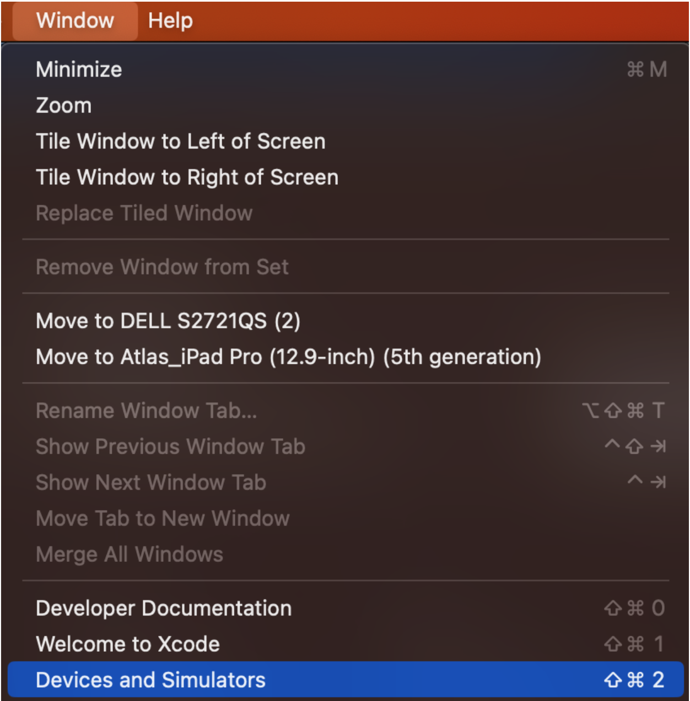
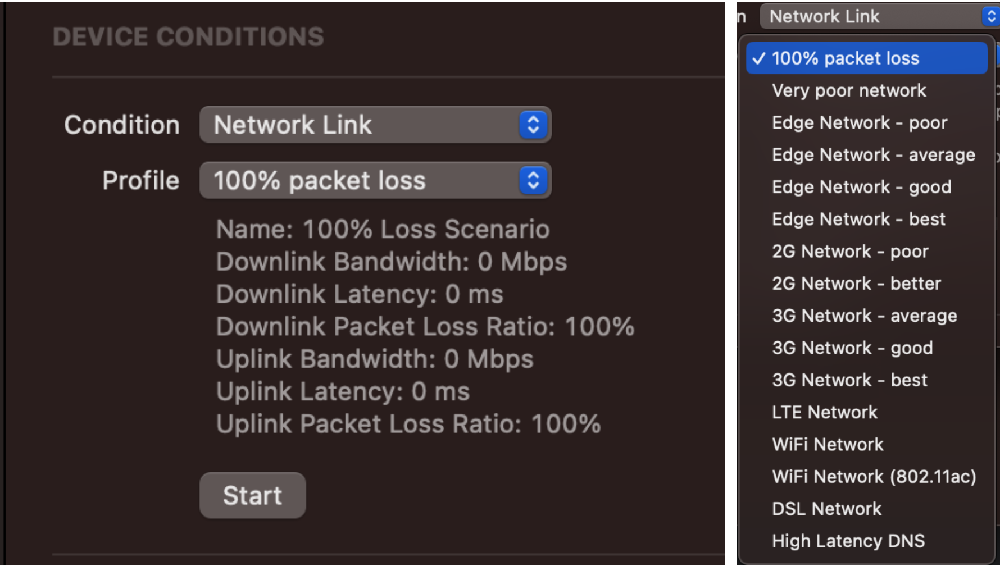
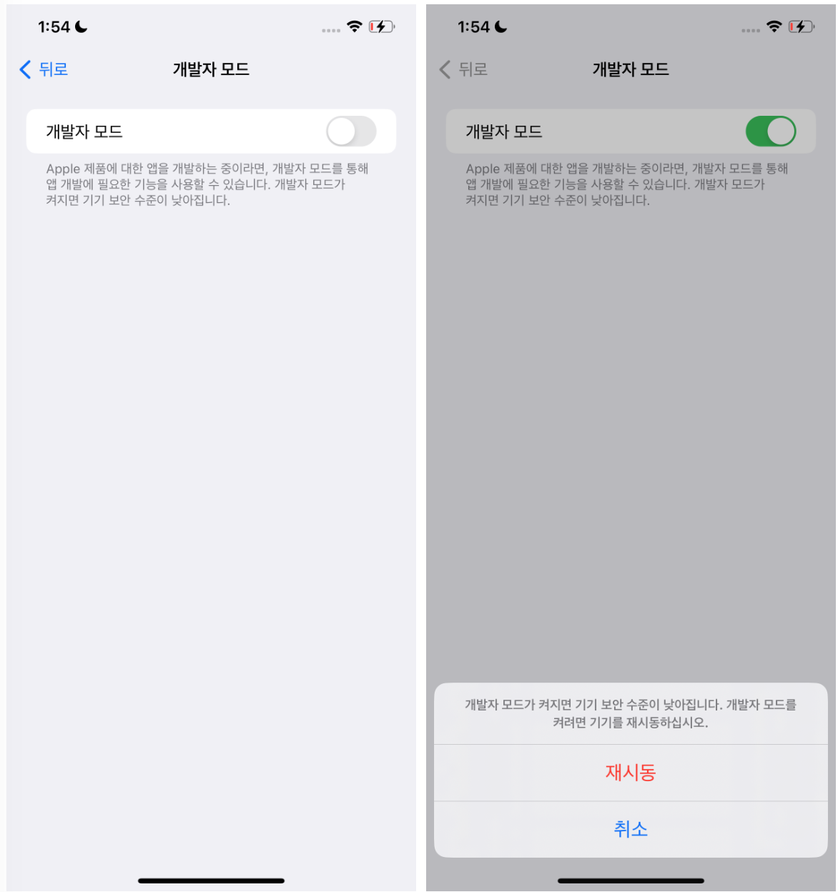
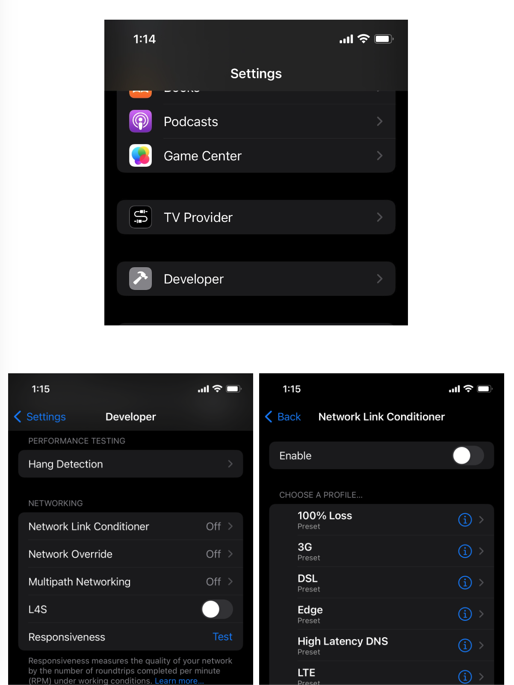

## XCode 에서 컨트롤 

Xcode를 실행시킨 다음 아래 2가지 방법 중 하나로 Devices and Simulators 창을 연다.

 

1. Window > Devices and Simulators 

2. 엑스코드 실행 기기 선택할 수 있는 리스트 > Manage Run Destinations...  

좌측 상단의 Connected에 테스트할 시뮬레이터가 아닌 **아이폰 실기기가 연결**되어있어야한다

`Tips. Xcode15에서는 유선으로 한번 연결을 진행하면 무선빌드가 가
능

###  네트워트 상태 조절하는 방법 

## 실기기에서 컨트롤 
세팅 > 개발자모드 > 네크워크 링크 컨디셔너 페이지로 이동해서 네트워트 상태를 조절할 수 있다.

### 실기기에서 네트워트 상태 조절하는 방법 

