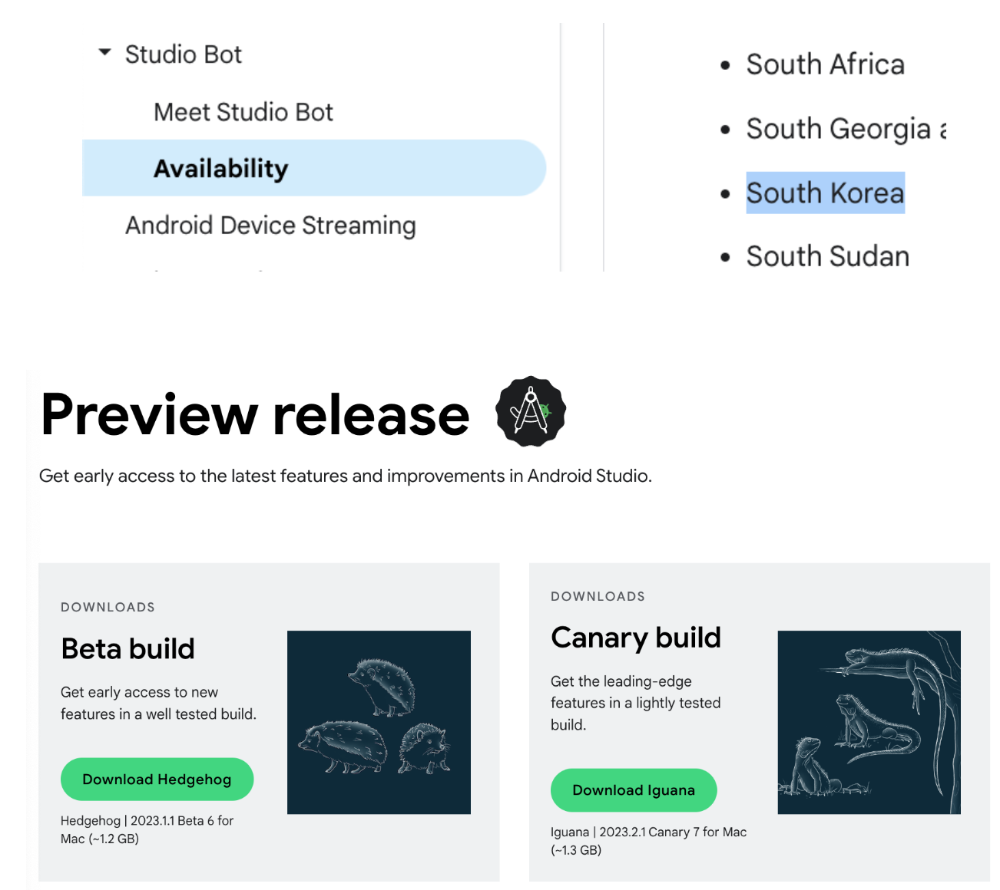
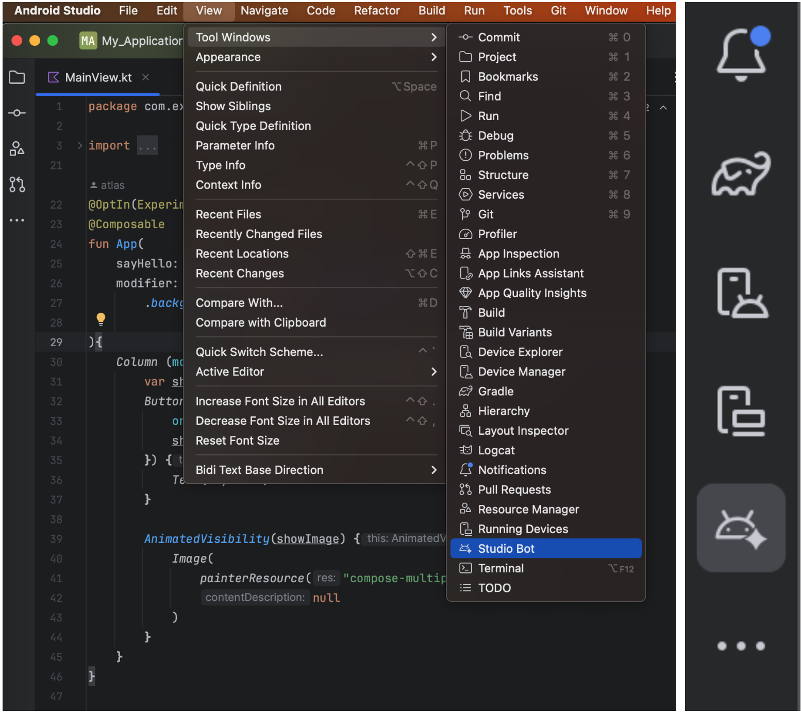
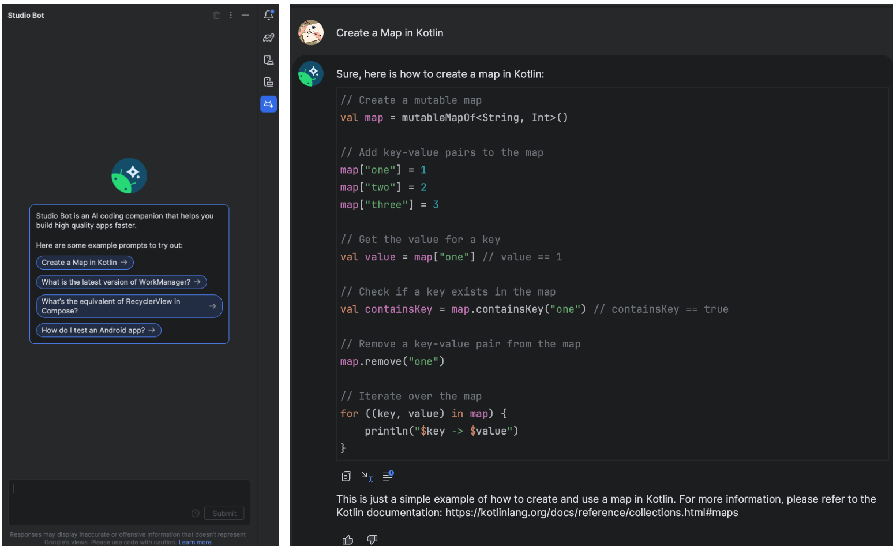
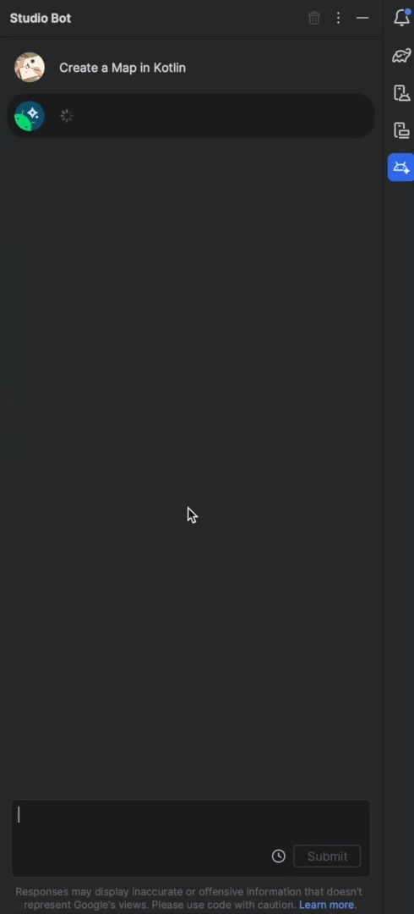
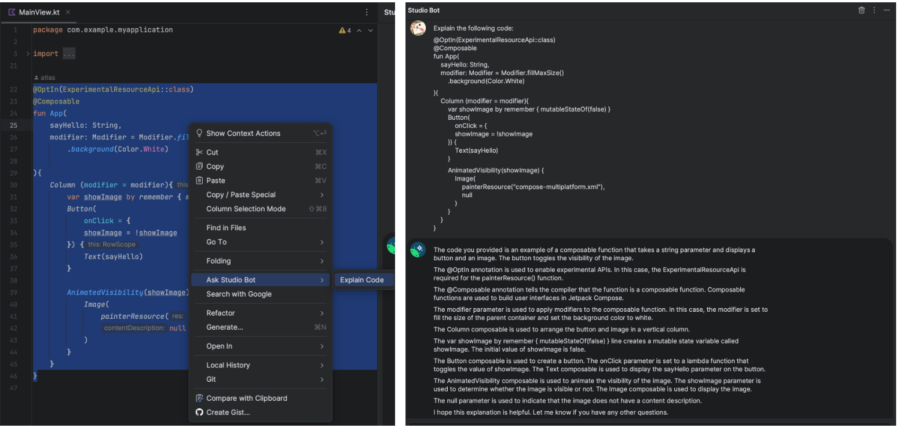
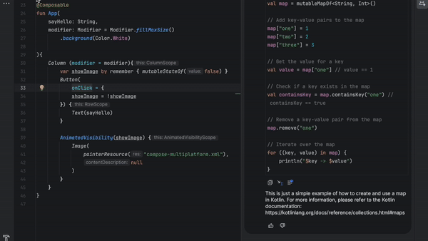
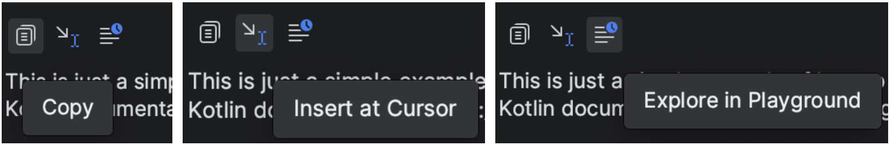

## 스튜디오 봇

스튜디오 봇이란?
- Android Studio IDE에 통합된 챗봇
- LLM로 학습된 데이터 기반 동작
- 코드 생성, 관련 리소스 검색, 모범사례 학습, 시간절약

**사용해보기**

스튜디오 봇은 Hedgehog, Iguana 버전에서 확인할 수 있기 때문에 프리뷰를 다운받아야한다. 

다운로드 후 프로그램을 실행하고 

1. View > Tool Windows > Studio Bot 을 클릭하거나 

2. 우측 패널에 스튜디오 봇 숏컷이 있다. 

### 코드분석
코드분석을 위해서는 스튜디오 서버에 코드를 보내는것을 동의하는 팝업창이 뜨는데 회사코드의 경우는 사용에 ⚠️주의⚠️가 필요

스튜디오 봇의 답변 하단에 복사,코드삽입,플레이그라운드에서 실행 3가지 버튼을 제공한다.
