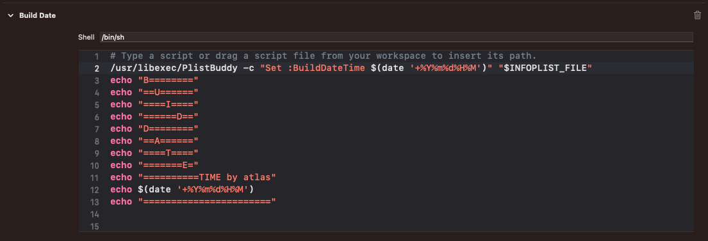

## 커스텀 스크립트 추가 방법
1. 스크립트 추가 
타켓 > Build Phases > "+" 클릭 > New Run 
Script Phase 


스크립트 추가 
```
/usr/libexec/PlistBuddy -c "Set :BuildTimeStamp $(date '+%Y%m%d%H%M')" "$INFOPLIST_FILE"

```

### 스크립트 실행 체크 항목 


### 전체 스크립트 
```
# Type a script or drag a script file from your workspace to insert its path.
/usr/libexec/PlistBuddy -c "Set :BuildDateTime $(date '+%Y%m%d%H%M')" "$INFOPLIST_FILE"
echo "B========"
echo "==U======"
echo "====I===="
echo "======D=="
echo "D========"
echo "==A======"
echo "====T===="
echo "=======E="
echo "==========TIME by atlas"
echo $(date '+%Y%m%d%H%M')
echo "======================="

```


## 2. .plist에 사용할 키 추가 
스크립트에서 선언한 변수가 저장될 키를 .plist에 생성한다. 


### 빌드 로그 확인 

