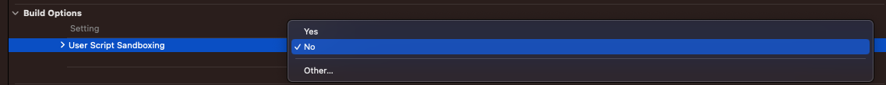

## Error Reading File /...Info.plist

Xcode 15에서 **User Script Sandboxing** 이 기본적으로 **YES**로 설정이 되어 있기 때문에 User Script Sandboxing 값을 **No** 로 업데이트 해주고 빌드를 하면 원하는 결과를 얻을 수 있다.  (Xcode 14에서는 기본적으로 NO로 설정되어 있음)

 

