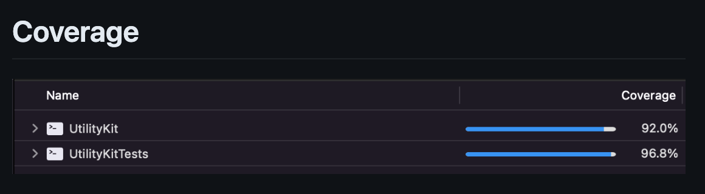

# UtilityKit 

**각 프로젝트에서 공통으로 사용되는 기능들을 모듈화하여 라이브러리로 제공하여 개발시간 단축 및 효율성 보장합니다.**

## Requirement

iOS 11.0+/macOS 10.13+/tvOS 11.0+/watchOS 4.0+
[Apple developer](https://developer.apple.com/documentation/swift/array/reduce(_:_:))

## Installation 

File > Swift Packages > Add Package Dependency
Add https://github.com/dev-rsquare/UtilityKit.git
Select "Up to Next Major" with 0.0.8

``` swift 
  .package(url: "https://github.com/dev-rsquare/UtilityKit.git", .upToNextMajor(from: "0.0.8"))
```

## Coverage


