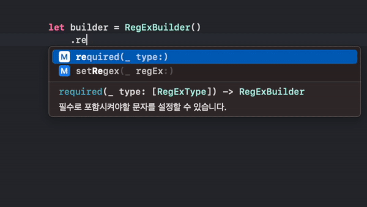
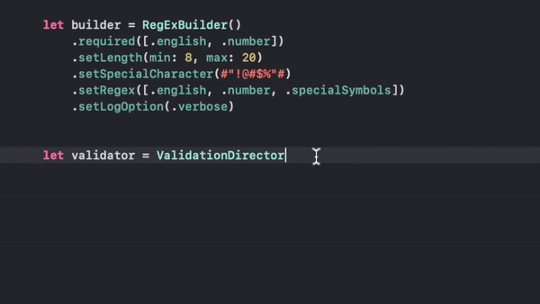
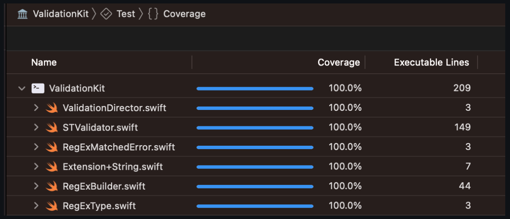

# 유효성 검사

 **원하는 형식의 정규식을 간편하게 만들어 유효성검사를 진행 할 수 있는 기능을 제공합니다.**


## 사용법

### 이메일 유효성 검사하기 : 
**사용법 : {String}.isValidEmail()**   
설명 : 문자열이 이메일 형식이 맞는지 확인합니다.  
``` swift 
    [요청]
    "abc@abc.com".isValidEmail()

    [출력]
    true
```

### 커스텀 정규식 생성해서 유효성 검사하기 

 [옵션 설명]
``` swift
    .required([.english, .number, , .korean, .specialSymbols]) // 필수로 포함되어야하는 설정
     //영어, 숫자, 한글, 특수문자 4가지 옵션을 제공합니다.
```
``` swift
    .setLength(min: Int, max: Int) // 최소 최대 글자
```
``` swift
    .setSpecialCharacter(#",<.>\/?;:'"\[{\]}`~₩!@#$%^&*()-_=+\|"#) // 특수문자 설정
    //#""# 포맷형식으로 특수문자열을 전달합니다. 예시를 꼭 참고해주세요.
```
``` swift
    .setRegex([.english, .number, , .korean, .specialSymbols]) // 포함되어야하는 조건
    //영어, 숫자, 한글, 특수문자 4가지 옵션을 제공합니다.
```
``` swift
    .setLogOption(.verbose) // 로그레벨
```


### 예시 조건 
1.필수로 포함되어야하는 조건은 영어, 숫자, 특수문자  
2.입력받을 문자열의 길이의 최소길이는 8, 최대길이는 20 으로 설정  
3.커스텀으로 특수문자 지정   
4.로그레벨 .verbose (상세한 로그 제공)  

**Code 사용법**
``` swift
let builder = RegExBuilder()
                    .required([.english,.number,.specialSymbols]) 
                    .setLength(min: 8, max: 20)
                    .setSpecialCharacter(#",<.>\/?;:'"\[{\]}`~₩!@#$%^&*()-_=+\|"#) 
                    .setLogOption(.verbose)

    //ValidationDirector를 통해 validator 인스턴스를 생성해주세요.
    let validator = ValidationDirector.createValidator(builder: builder)


    let YOURTEXT = "123456789"
    // validator 인스턴스의 isValid(String)을 통해서 유효성 검사를 진행하시면 됩니다.
    validator.isValid(YOURTEXT) { response in
        switch response {
        case .success(let success):
            print(success)
        case .failure(let failure):
            print(failure.desc)
        }
    }
    
//    예상 결과 : 영어가 포함되어 있지 않습니다
```

### 사용시 주의사항
특수문자 설정시 **#"{String}"#** 포맷안에 특수문자열을 전달해주세요.  
포함조건에 특수문자가 포함되어 있지 않더라도 필수로 포함되어야하는 조건을 설정하는 경우 커스텀 특수문자가 지정을 하지않으면 기본값으로 저장된 특수문자 값을 사용합니다. 


## Quick Help 제공



## Coverage


